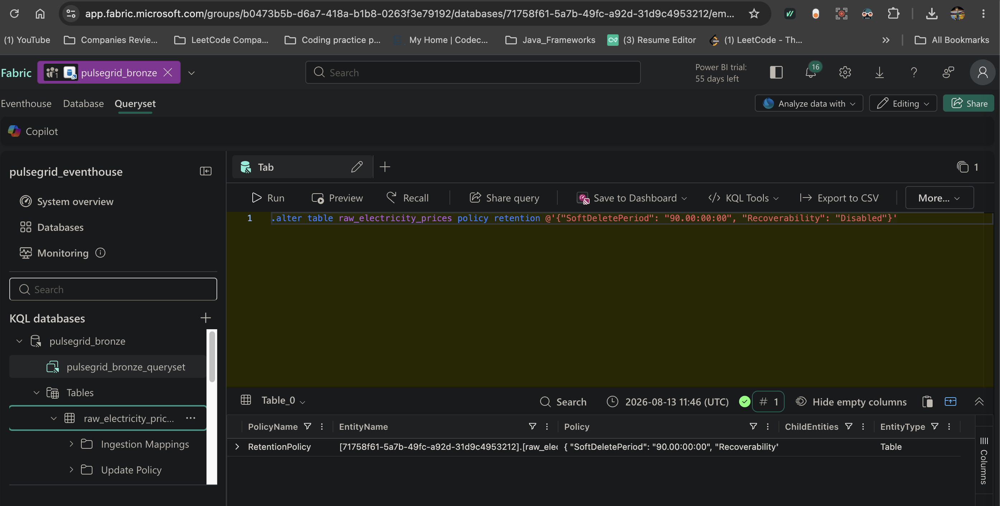
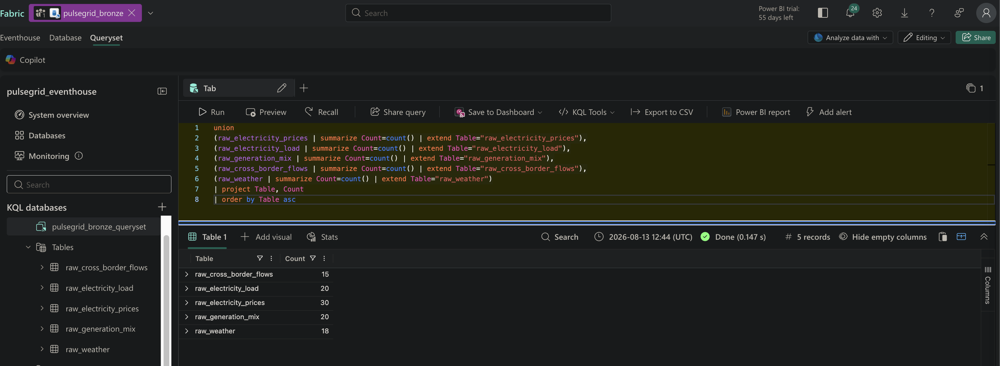
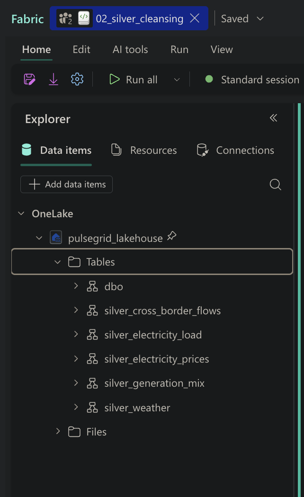
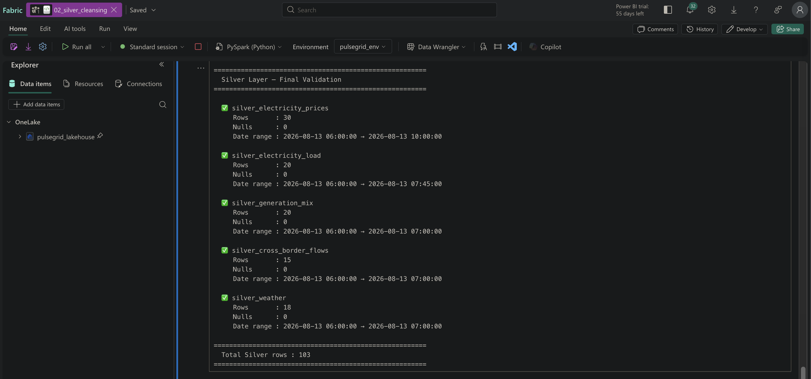
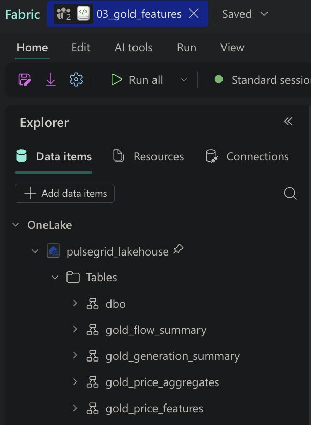
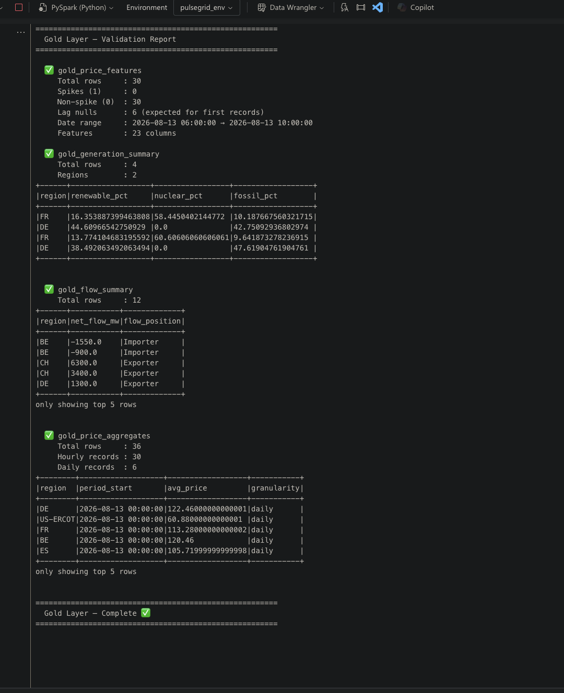

# PulseGrid — Technical Specification

> Phase-by-phase engineering implementation journal for the PulseGrid Real-Time Energy Market Intelligence Platform on Microsoft Fabric.

---

## Document Purpose

This document serves as the authoritative technical reference for the PulseGrid project. It records every implementation decision, configuration, code, and validation step across all phases — providing full traceability from raw ingestion to AI-powered analytics.

---

## Platform Constraints & Design Decisions

| Constraint | Decision |
|---|---|
| Microsoft Fabric Trial | All components scoped to Trial-available features only |
| No Fabric Data Agent | Claude API + Streamlit used as the AI agent layer |
| Free API tier limits | Event-aligned polling strategy — each source polled at its actual update frequency |
| API key security | Fabric Environment (Spark properties) — keys never hardcoded in notebooks or Git |
| Trial capacity limits | Delta OPTIMIZE run post-load only; no continuous VACUUM |

---

## Phase 1 — Bronze Layer (Data Ingestion)

### Objective
Establish the real-time ingestion foundation. Raw electricity market data from three public APIs lands into a KQL Database as the Bronze layer — append-only, no transformations, schema-on-read. Five dedicated tables capture prices, load, generation mix, cross-border flows, and weather.

---

### 1.1 Fabric Workspace Setup

A new Fabric workspace named **PulseGrid** was created under the Trial license.

**Workspace items provisioned:**

| Item Name | Type | Role |
|---|---|---|
| `pulsegrid_eventhouse` | Eventhouse | Container for KQL databases |
| `pulsegrid_bronze` | KQL Database | Bronze raw data store |
| `pulsegrid_eventstream` | Eventstream | Real-time ingestion pipeline |
| `pulsegrid_lakehouse` | Lakehouse | Silver + Gold Delta store |
| `pulsegrid_env` | Environment | API key store + library management |


---

### 1.2 Fabric Environment — Secret Management

A Fabric Environment (`pulsegrid_env`) was created to store API credentials securely as Spark properties. API keys are never hardcoded in notebook source or committed to Git.

**Spark properties configured:**

| Property | Purpose |
|---|---|
| `spark.pulsegrid.entsoe_token` | ENTSO-E Transparency Platform API token |
| `spark.pulsegrid.eia_key` | EIA Open Data API key |

Keys read at runtime via:
```python
ENTSOE_API_TOKEN = spark.conf.get("spark.pulsegrid.entsoe_token")
EIA_API_KEY      = spark.conf.get("spark.pulsegrid.eia_key")
```


---

### 1.3 API Registration & Rate Limits

| Source | Registration | Limit | Our Usage |
|---|---|---|---|
| ENTSO-E | Free — email verification + token generation | 400 req/min per token | ~2 req/min avg |
| EIA | Free — instant API key via email | Throttled per hour (unpublished) | ~1 req/min avg |
| Open-Meteo | No registration — no API key needed | 10,000 calls/day | ~1,440 calls/day |

---

### 1.4 Rate Limiting Strategy — Event-Aligned Polling

**Problem with naive 5-minute polling:**
ENTSO-E day-ahead prices are published once per day. Polling every 5 minutes fetches the same value 288 times — wasting rate limit budget on duplicate data.

**Solution — Poll each source at its actual update frequency:**

| Notebook | Schedule | Sources | Tables Written |
|---|---|---|---|
| `01a_daily_price_poller` | Once/day at 13:00 CET | ENTSO-E day-ahead prices (26 zones) | `raw_electricity_prices` |
| `01b_realtime_poller` | Every 15 min | ENTSO-E load + generation + cross-border | `raw_electricity_load`, `raw_generation_mix`, `raw_cross_border_flows` |
| `01c_weather_eia_poller` | Every 30 min | Open-Meteo (30 cities) + EIA (13 RTOs) | `raw_weather`, `raw_electricity_prices` (US) |

**Additional protections:**
- Exponential backoff with jitter — `2^attempt + random(0, 1.0)` seconds
- Poll guard — skips cycle if last run < minimum interval (state in Lakehouse Files)
- Temperature fetched once per region per cycle — not once per record
- All API calls wrapped in `call_with_retry()` with `MAX_RETRIES = 3`

**Daily API call budget:**

| Source | Calls/Day | Limit | Headroom |
|---|---|---|---|
| ENTSO-E total | ~6,500 | 576,000 (400/min) | 99% |
| EIA | ~312 | Unpublished | Conservative |
| Open-Meteo | ~1,440 | 10,000 | 85% |

---

### 1.5 Bronze Tables — Schema & Design

All 5 tables created in `pulsegrid_bronze` with 90-day retention and recoverability disabled.




| Table | Source | Frequency | Key Columns |
|---|---|---|---|
| `raw_electricity_prices` | ENTSO-E + EIA | Once/day + hourly | region, event_time, price_eur_mwh |
| `raw_electricity_load` | ENTSO-E | Every 15 min | region, event_time, load_mw |
| `raw_generation_mix` | ENTSO-E | Every 15 min | region, event_time, fuel_type, generation_mw |
| `raw_cross_border_flows` | ENTSO-E | Every 15 min | from_region, to_region, event_time, flow_mw |
| `raw_weather` | Open-Meteo | Every 30 min | region, event_time, temperature_c, wind_speed_ms |

Retention policy applied to all tables:
```kql
.alter table <table_name> policy retention
@'{"SoftDeletePeriod": "90.00:00:00", "Recoverability": "Disabled"}'
```

---

### 1.6 Phase 1 Summary

| Item | Status |
|---|---|
| Fabric workspace `PulseGrid` created | ✅ |
| Eventhouse + KQL Database `pulsegrid_bronze` | ✅ |
| Eventstream `pulsegrid_eventstream` | ✅ |
| Lakehouse `pulsegrid_lakehouse` | ✅ |
| Environment `pulsegrid_env` + API keys | ✅ |
| All 5 Bronze tables + retention policies | ✅ |

---

## Phase 2 — Silver Layer (PySpark Cleansing + Spark Optimizations)

### Objective
Read raw data from all 5 Bronze KQL tables, apply business rules and Spark optimizations, and write clean Delta tables to the Silver layer in `pulsegrid_lakehouse`. All 5 tables processed in parallel using `ThreadPoolExecutor`.

---

### 2.1 Architecture Decision — Parallel Processing

Rather than 5 separate notebooks or sequential processing, a single notebook (`02_silver_cleansing`) processes all 5 Bronze tables concurrently using Python's `ThreadPoolExecutor`.

**Why ThreadPoolExecutor works with Spark:**
- Spark DataFrame operations are thread-safe
- Each thread submits independent Spark jobs to the cluster
- Spark scheduler runs jobs concurrently on available executors
- Total wall time ≈ slowest single table (not sum of all tables)

```python
MAX_WORKERS = 5  # One thread per Bronze table

with ThreadPoolExecutor(max_workers=MAX_WORKERS) as executor:
    futures = {executor.submit(process_table, task): task for task in SILVER_TASKS}
    for future in as_completed(futures):
        result = future.result()
        results.append(result)
```

---

### 2.2 Spark Optimization Techniques Applied

| Technique | Where Applied | Rationale |
|---|---|---|
| **Predicate pushdown** | KQL reader (all tables) | Filter `ago(7d)` executes on KQL engine before data reaches Spark — reduces wire transfer |
| **Native functions only — no UDFs** | All cleansing functions | `F.when`, `F.coalesce`, `F.upper`, `F.trim`, `F.to_timestamp` — Catalyst-visible; UDFs are opaque and add Python↔JVM serialization per row |
| **Window function for dedup** | All tables | `row_number()` over natural key ordered by `ingestion_time DESC` — fully distributed, no `collect()` to driver |
| **`repartition()` by region + hour** | prices, load, weather | Aligns Spark partitions with Gold aggregation access patterns |
| **`repartition()` by region + fuel_type** | generation_mix | Aligns with Gold fuel-type aggregations |
| **`partitionBy(year, month, day)`** | All Silver writes | Enables partition pruning on Gold reads filtered by date range |
| **Idempotent MERGE** | All Silver writes | Safe for reruns and pipeline retries — MERGE on natural key |

---

### 2.3 Table-Specific Cleansing Rules

#### `silver_electricity_prices`
| Rule | Implementation |
|---|---|
| Price range validation | Nullify if outside `[-500, 5000]` EUR/MWh — European markets allow negative prices during oversupply |
| Load validation | Nullify if negative — physically impossible |
| Temperature null fill | `coalesce(temperature_c, 0.0)` — sensor outage fallback |
| Region normalization | `upper(trim(region))` — standardize "de ", "DE", "De" → "DE" |
| Dedup key | `(region, event_time)` |

#### `silver_electricity_load`
| Rule | Implementation |
|---|---|
| Load validation | Nullify if `<= 0` or `> 1,000,000` MW — data error guard |
| Region normalization | `upper(trim(region))` |
| Dedup key | `(region, event_time)` |

#### `silver_generation_mix`
| Rule | Implementation |
|---|---|
| Generation validation | Nullify if negative — no negative physical generation |
| Fuel type normalization | `initcap(trim(fuel_type))` — "wind onshore" → "Wind Onshore" |
| Region normalization | `upper(trim(region))` |
| Dedup key | `(region, event_time, fuel_type)` |

#### `silver_cross_border_flows`
| Rule | Implementation |
|---|---|
| Self-flow removal | Filter `from_region != to_region` — data error |
| Region normalization | `upper(trim())` on both from/to |
| Note | Negative `flow_mw` is valid — represents import direction |
| Dedup key | `(from_region, to_region, event_time)` |

#### `silver_weather`
| Rule | Implementation |
|---|---|
| Temperature range | Nullify outside `[-60, 60]` °C |
| Wind speed | Nullify if `< 0` or `> 100` m/s |
| Humidity | Nullify outside `[0, 100]` % |
| Solar radiation | Nullify if `< 0` or `> 1500` W/m² |
| Null fill | `coalesce(col, 0.0)` for all numeric fields — sensor outage fallback |
| Dedup key | `(region, event_time)` |

---

### 2.4 Silver Write Strategy — Idempotent MERGE

```python
merge_condition = " AND ".join(
    [f"target.{k} = source.{k}" for k in merge_keys]
)

delta_table.alias("target").merge(
    df.alias("source"), merge_condition
) \
.whenMatchedUpdateAll() \
.whenNotMatchedInsertAll() \
.execute()
```

- First run → full Delta write (table creation)
- Subsequent runs → MERGE on natural key
- `mergeSchema = false` — rejects unexpected schema changes

---

### 2.5 Bronze Seed Data

103 test records seeded across all 5 Bronze tables to validate the Silver pipeline before live poller is wired:



| Table | Seeded Records |
|---|---|
| `raw_electricity_prices` | 30 |
| `raw_electricity_load` | 20 |
| `raw_generation_mix` | 20 |
| `raw_cross_border_flows` | 15 |
| `raw_weather` | 18 |

---

### 2.6 Silver Validation Results

All 5 Silver Delta tables written and validated — zero nulls across all tables:




| Table | Rows | Nulls | Date Range |
|---|---|---|---|
| `silver_electricity_prices` | 30 | 0 | 2026-08-13 06:00 → 10:00 |
| `silver_electricity_load` | 20 | 0 | 2026-08-13 06:00 → 07:45 |
| `silver_generation_mix` | 20 | 0 | 2026-08-13 06:00 → 07:00 |
| `silver_cross_border_flows` | 15 | 0 | 2026-08-13 06:00 → 07:00 |
| `silver_weather` | 18 | 0 | 2026-08-13 06:00 → 07:00 |
| **Total** | **103** | **0** | |

---

### 2.7 Phase 2 Summary

| Item | Status |
|---|---|
| `02_silver_cleansing` notebook created | ✅ |
| `pulsegrid_env` attached to notebook | ✅ |
| Parallel processing via ThreadPoolExecutor | ✅ |
| All Spark optimizations applied | ✅ |
| 5 Silver Delta tables created | ✅ |
| Zero nulls across all tables | ✅ |
| Idempotent MERGE strategy validated | ✅ |

---

## Phase 3 — Gold Layer (Feature Engineering)

> ⬜ Pending

---

## Phase 4 — ML (XGBoost Spike Predictor)

> ⬜ Pending

---

## Phase 5 — Power BI Semantic Model

> ⬜ Pending

---

## Phase 6 — AI Agent (Claude API + Streamlit)

> ⬜ Pending

---

## Appendix A — Spark Optimization Techniques

| Technique | Phase | Rationale |
|---|---|---|
| Predicate pushdown on `ingestion_date`, `region` | Silver | Avoids full Delta scan; leverages file skipping |
| Native Spark functions only (no UDFs) | Silver | Catalyst can optimize; no serialization overhead |
| `repartition()` by `region` + `hour` | Silver | Aligns write partitions to downstream query patterns |
| Window function for dedup (`row_number`) | Silver | Fully distributed; no `collect()` to driver |
| `broadcast()` hint on holidays table | Gold | ~300 row table; eliminates shuffle on large price table |
| Window functions for lag features | Gold | Fully distributed lag feature engineering |
| AQE (Adaptive Query Execution) | Gold | Post-shuffle partition coalescing on aggregations |
| `cache()` on feature table | ML | Feature table read twice (train + score); avoids re-scan |
| `persist(MEMORY_AND_DISK)` before train/test split | ML | Split computed twice otherwise |
| Delta `OPTIMIZE` + `ZORDER BY (region, event_time)` | Gold | Improves read performance for Semantic Model + agent |
| `partitionBy("year","month","day")` at write | Silver + Gold | Avoids over-partitioning; right-sized for data volume |
| Parallel ThreadPoolExecutor (5 workers) | Silver | All 5 tables processed simultaneously |

---

## Appendix B — ENTSO-E Bidding Zone Codes

| Region | Zone Key | Country |
|---|---|---|
| DE | 10Y1001A1001A83F | Germany |
| FR | 10YFR-RTE------C | France |
| ES | 10YES-REE------0 | Spain |
| NL | 10YNL----------L | Netherlands |
| BE | 10YBE----------2 | Belgium |
| IT | 10YIT-GRTN-----B | Italy |
| PL | 10YPL-AREA-----S | Poland |
| AT | 10YAT-APG------L | Austria |
| CH | 10YCH-SWISSGRIDZ | Switzerland |
| PT | 10YPT-REN------W | Portugal |

---

*Last updated: Phase 2 complete — August 2026*

---

## Phase 3 — Gold Layer (Feature Engineering)

### Objective
Read from all 5 Silver Delta tables, apply feature engineering and aggregations using Spark optimizations, and write 4 curated Gold tables that feed the ML model and Power BI Semantic Model.

---

### 3.1 Gold Tables Built

| Table | Purpose | Rows |
|---|---|---|
| `gold_price_features` | Core ML feature table — 23 features per record | 30 |
| `gold_generation_summary` | Hourly generation mix ratios per region | 4 |
| `gold_flow_summary` | Net cross-border flow position per region | 12 |
| `gold_price_aggregates` | Hourly + daily aggregates for Power BI | 36 |



---

### 3.2 Spark Optimization Techniques Applied

| Technique | Where | Rationale |
|---|---|---|
| `cache()` on Silver prices | Cell 2 | prices DataFrame read multiple times across joins — avoids Delta re-scan |
| `broadcast()` on holidays | Cell 3 | ~16 row table — eliminates shuffle on join with large prices table |
| Window functions — `lag()` | Cell 4 | `price_lag_1h/12h/24h` — fully distributed, no `collect()` to driver |
| Window functions — `avg()`, `stddev()` | Cell 4 | Rolling 6h mean + std dev — range-based window in seconds |
| `percentile_approx()` | Cell 4 | Catalyst-optimized — no UDF needed for p90 threshold |
| Native functions only | All cells | `F.when`, `F.coalesce`, `F.date_trunc`, `F.abs` — Catalyst-safe throughout |
| `drop()` before joins | Cells 4, 7 | Prevents `AnalysisException: DELTA_DUPLICATE_COLUMNS_FOUND` |
| AQE — coalesce shuffle | Cells 5, 6, 7 | `groupBy` + `pivot` shuffles auto-coalesced by AQE post-aggregation |
| `OPTIMIZE` + `ZORDER BY` | Cell 8 | Compacts small files after MERGE; co-locates by `(region, event_time)` for file skipping |
| `partitionBy(year, month, day)` | All writes | Partition pruning on downstream reads filtered by date range |
| Idempotent MERGE | All writes | Safe reruns — MERGE on natural key per table |

---

### 3.3 Feature Engineering — gold_price_features

23 features engineered per record:

| Feature | Type | Description |
|---|---|---|
| `price_eur_mwh` | Double | Raw day-ahead price |
| `price_lag_1h` | Double | Price 1 hour ago — short-term momentum |
| `price_lag_12h` | Double | Price 12 hours ago — half-day pattern |
| `price_lag_24h` | Double | Price 24 hours ago — same-hour yesterday |
| `price_rolling_avg_6h` | Double | 6-hour rolling mean — trend indicator |
| `price_rolling_std_6h` | Double | 6-hour rolling std dev — volatility indicator |
| `hour_of_day` | Integer | 0-23 — peak hour indicator |
| `day_of_week` | Integer | 1-7 — weekday vs weekend demand pattern |
| `is_weekend` | Boolean | Lower industrial demand flag |
| `is_holiday` | Boolean | Demand profile shift flag |
| `temperature_c` | Double | Heating/cooling demand proxy |
| `wind_speed_ms` | Double | Wind generation proxy — suppresses prices |
| `humidity_pct` | Double | Weather enrichment |
| `solar_radiation` | Double | Solar generation proxy — suppresses prices |
| `load_mw` | Double | Actual grid load — 15-min granularity |
| `is_spike` | Boolean | **Target label** — price > 90th percentile |

**Spike label distribution:**
- Spikes (1): 0 — expected with seed data (narrow price range)
- Non-spike (0): 30
- Will distribute naturally with live data

---

### 3.4 Generation Mix Insights (seed data)

| Region | Renewable % | Nuclear % | Fossil % |
|---|---|---|---|
| FR | ~15% | ~59% | ~10% |
| DE | ~42% | 0% | ~45% |

FR is nuclear-heavy — stable baseload, lower price volatility. DE is renewable + gas mix — higher volatility, stronger weather correlation.

---

### 3.5 Flow Position Insights (seed data)

| Region | Position | Net Flow MW |
|---|---|---|
| CH | Exporter | +6,300 |
| DE | Exporter | +1,300 |
| BE | Importer | -1,550 |

Net importers tend to have higher prices — key ML feature.

---

### 3.6 Price Aggregates (seed data)

| Region | Daily Avg Price (EUR/MWh) |
|---|---|
| DE | 122.46 |
| BE | 120.46 |
| FR | 113.28 |
| ES | 105.72 |
| US-ERCOT | 60.88 |

---

### 3.7 Phase 3 Summary

| Item | Status |
|---|---|
| `03_gold_features` notebook created | ✅ |
| AQE explicitly enabled | ✅ |
| `gold_price_features` — 23 features | ✅ |
| `gold_generation_summary` — mix ratios | ✅ |
| `gold_flow_summary` — net positions | ✅ |
| `gold_price_aggregates` — hourly + daily | ✅ |
| Delta OPTIMIZE + ZORDER on all tables | ✅ |
| Duplicate column conflicts resolved | ✅ |
| All 4 Gold tables validated | ✅ |



---

*Last updated: Phase 3 complete — August 2026*
