# PulseGrid — Technical Specification

> Phase-by-phase engineering implementation journal for the PulseGrid Real-Time Energy Market Intelligence Platform on Microsoft Fabric.

---

## Document Purpose

This document serves as the authoritative technical reference for the PulseGrid project. It records every implementation decision, configuration, code, and validation step across all phases — providing full traceability from raw ingestion to AI-powered analytics.

---

## Platform Constraints & Design Decisions

| Constraint | Decision |
|---|---|
| Microsoft Fabric Trial | All components scoped to Trial-available features only |
| No Fabric Data Agent | Claude API + Streamlit used as the AI agent layer |
| Spark network restrictions | Open-Meteo blocked — replaced with Visual Crossing Weather API |
| Trial Spark capacity (430 limit) | Pollers run sequentially, not simultaneously |
| Free API tier limits | Event-aligned polling — each source polled at its actual update frequency |
| API key security | Fabric Environment Spark properties — keys never hardcoded in notebooks or Git |
| Trial storage limits | 90-day retention, recoverability disabled on all KQL tables |

---

## Phase 1 — Bronze Layer (Data Ingestion)

### Objective

Establish the real-time ingestion foundation. Raw electricity market data from four public APIs lands into a KQL Database as the Bronze layer — append-only, no transformations, schema-on-read. Five dedicated tables capture prices, load, generation mix, cross-border flows, and weather.

---

### 1.1 Fabric Workspace Setup

**Workspace:** `PulseGrid` — Microsoft Fabric Trial.

**Items provisioned:**

| Item | Type | Role |
|---|---|---|
| `pulsegrid_eventhouse` | Eventhouse | Container for KQL databases |
| `pulsegrid_bronze` | KQL Database | Bronze raw data store |
| `pulsegrid_eventstream` | Eventstream | Real-time ingestion pipeline (reserved) |
| `pulsegrid_lakehouse` | Lakehouse | Silver + Gold Delta store |
| `pulsegrid_env` | Environment | API key store + library management |


---

### 1.2 Fabric Environment — Secret Management

**Environment:** `pulsegrid_env` — stores all API credentials as Spark properties.

| Property | Source |
|---|---|
| `spark.pulsegrid.entsoe_token` | ENTSO-E Transparency Platform |
| `spark.pulsegrid.eia_key` | EIA Open Data |
| `spark.pulsegrid.visualcrossing_key` | Visual Crossing Weather API |


---

### 1.3 API Registration & Rate Limits

| Source | Limit | Daily Usage | Headroom |
|---|---|---|---|
| ENTSO-E | 400 req/min per token | ~6,500 calls | 99% |
| EIA | Throttled/hour (unpublished) | ~624 calls | Conservative |
| Visual Crossing | 1,000 records/day | 960 records | 4% |
| Open-Meteo | 10,000 calls/day | **Blocked on Fabric** | N/A |

**Open-Meteo finding:** Fabric Trial Spark executors block outbound HTTP to `api.open-meteo.com`. Visual Crossing used as replacement — confirmed reachable from Fabric.

---

### 1.4 Rate Limiting Strategy — Event-Aligned Polling

| Notebook | Schedule | Sources | Tables Written |
|---|---|---|---|
| `01a_daily_price_poller` | Once/day at 13:00 CET | ENTSO-E day-ahead prices (27 zones) | `raw_electricity_prices` |
| `01b_realtime_poller` | Every 15 min | ENTSO-E load + generation + cross-border | `raw_electricity_load`, `raw_generation_mix`, `raw_cross_border_flows` |
| `01c_weather_eia_poller` | Every 30 min | Visual Crossing (20 cities) + EIA (13 RTOs) | `raw_weather`, `raw_electricity_prices` |

**Additional protections:**
- Exponential backoff with jitter on every API call
- `NoMatchingDataError` skipped immediately — no retries on missing data
- Two-stage fetch in `01b`: narrow 30-min window first, wide 6-hour fallback for slow TSOs
- Arrow optimization disabled for nullable float64 columns
- Sequential poller execution — Fabric Trial 430 error triggered on simultaneous runs

---

### 1.5 Poller Results — First Live Run

| Poller | Records Written | Duration | Failed |
|---|---|---|---|
| `01a` — ENTSO-E prices | 2,520 (27/27 zones) | 246.4s | None |
| `01b` — load + generation + flows | 1,879 | 207.3s | SE-3→DK-2 flow (unavailable) |
| `01c` — weather + EIA | 56 (20 cities + 13 RTOs) | 220.2s | None |


---

### 1.6 Bronze Tables — Live Record Counts


| Table | Records | Frequency |
|---|---|---|
| `raw_electricity_prices` | 2,556 | Once/day + every 30 min |
| `raw_electricity_load` | 120 | Every 15 min |
| `raw_generation_mix` | 1,669 | Every 15 min |
| `raw_cross_border_flows` | 90 | Every 15 min |
| `raw_weather` | 20 | Every 30 min |
| **Total** | **4,455** | |

---

### 1.7 Phase 1 Summary

| Item | Status |
|---|---|
| Fabric workspace + all items provisioned | ✅ |
| 3 API keys registered + stored in Environment | ✅ |
| All 5 Bronze KQL tables + retention policies | ✅ |
| 3 pollers running with live data | ✅ |
| Open-Meteo blocked → Visual Crossing substituted | ✅ |
| Total Bronze records: 4,455 | ✅ |

---

## Phase 2 — Silver Layer (Parallel PySpark Cleansing)

### Objective

Read all 5 Bronze KQL tables into Spark, apply table-specific cleansing rules and Spark optimizations, and write clean Delta tables to the Silver layer of `pulsegrid_lakehouse`. All 5 tables processed in parallel using `ThreadPoolExecutor` — total execution time equals the slowest single table, not the sum.

---

### 2.1 Notebook — `02_silver_cleansing`

**Environment:** `pulsegrid_env` attached. **Default lakehouse:** `pulsegrid_lakehouse`.

**Structure:**

| Cell | Purpose |
|---|---|
| Cell 1 | Imports, config, Silver paths, parallel worker count |
| Cell 2 | Generic KQL Bronze reader with predicate pushdown |
| Cell 3 | Table-specific cleansing functions (5 tables) |
| Cell 4 | Generic Silver Delta writer — idempotent MERGE |
| Cell 5 | Parallel executor — ThreadPoolExecutor (MAX_WORKERS=5) |
| Cell 6 | Validation — all 5 Silver tables |

---

### 2.2 Spark Optimizations Applied

| Technique | Where | Rationale |
|---|---|---|
| **Predicate pushdown** | Cell 2 — KQL reader | `ago(7d)` filter executes on KQL engine before Spark ingestion — reduces data transferred across wire |
| **Native functions only (no UDFs)** | Cell 3 — all cleansing | `F.when`, `F.coalesce`, `F.upper`, `F.trim`, `F.to_timestamp` — Catalyst-visible, no Python↔JVM serialization |
| **Window function dedup** | Cell 3 — `deduplicate()` | `row_number()` over natural key ordered by `ingestion_time DESC` — fully distributed, no `collect()` |
| **`repartition()` by region + hour** | Cell 3 — `add_partitions_and_repartition()` | Aligns Spark partitions with Gold aggregation access patterns |
| **`partitionBy(year, month, day)`** | Cell 4 — writer | Right-sized Delta partitioning — avoids small-files problem from 5-min tick writes |
| **Idempotent MERGE** | Cell 4 — writer | Safe for reruns and pipeline retries — natural key match, update existing + insert new |
| **Parallel ThreadPoolExecutor** | Cell 5 | All 5 tables run simultaneously — total time ≈ slowest table (not sum) |

---

### 2.3 Cleansing Rules Per Table

**`silver_electricity_prices`**
- Nullify `price_eur_mwh` outside [-500, 5000] EUR/MWh (European markets allow negative prices during oversupply)
- Nullify negative `load_mw` (physically impossible)
- Fill null `temperature_c` with 0.0
- Normalize `region` to uppercase
- Deduplicate on `(region, event_time)`

**`silver_electricity_load`**
- Nullify `load_mw` ≤ 0 or > 1,000,000 MW (data errors)
- Normalize `region` to uppercase
- Deduplicate on `(region, event_time)`

**`silver_generation_mix`**
- Nullify negative `generation_mw`
- Normalize `fuel_type` to title case (`wind onshore` → `Wind Onshore`)
- Deduplicate on `(region, event_time, fuel_type)`

**`silver_cross_border_flows`**
- Normalize `from_region` and `to_region` to uppercase
- Remove self-flows (`from_region == to_region` — data error)
- Note: negative `flow_mw` is valid (import direction)
- Deduplicate on `(from_region, to_region, event_time)`

**`silver_weather`**
- `temperature_c`: valid range [-60, 60] °C
- `wind_speed_ms`: non-negative, cap at 100 m/s
- `humidity_pct`: valid range [0, 100] %
- `solar_radiation`: non-negative, cap at 1,500 W/m²
- Fill all nulls with 0.0 (sensor outage fallback)
- Deduplicate on `(region, event_time)`

---

### 2.4 Parallel Execution Results

All 5 tables processed simultaneously. Execution order determined by Spark job completion, not submission order.


| Table | Bronze Records | Silver Records | Status |
|---|---|---|---|
| `electricity_prices` | 36 | 66 | ✅ |
| `electricity_load` | 120 | 140 | ✅ |
| `generation_mix` | 1,669 | 1,689 | ✅ |
| `cross_border_flows` | 90 | 105 | ✅ |
| `weather` | 20 | 38 | ✅ |

> Silver row counts are higher than Bronze for some tables because Silver picked up both the initial live run and the previously cleared seed data remnants that were still within the 7-day KQL filter window. Deduplication on natural key ensured no duplicate records in Silver.

---

### 2.5 Silver Validation Report


| Table | Rows | Nulls | Date Range |
|---|---|---|---|
| `silver_electricity_prices` | 66 | 36 (EIA records — no price, load only) | 2026-08-13 → 2026-08-14 |
| `silver_electricity_load` | 140 | 1 (invalid value nullified) | 2026-08-13 → 2026-08-14 |
| `silver_generation_mix` | 1,689 | 0 | 2026-08-13 → 2026-08-14 |
| `silver_cross_border_flows` | 105 | 0 | 2026-08-13 → 2026-08-14 |
| `silver_weather` | 38 | 0 | 2026-08-13 → 2026-08-14 |

**Notes on nulls:**
- `silver_electricity_prices` — 36 nulls on `price_eur_mwh` are EIA demand records. EIA provides load (MW) only, not price. Expected and correct.
- `silver_electricity_load` — 1 null on `load_mw` — one Bronze record had an invalid value, correctly nullified by cleansing rule.

---

### 2.6 Phase 2 Summary

| Item | Status |
|---|---|
| `02_silver_cleansing` notebook created | ✅ |
| All 5 Bronze tables read via KQL connector | ✅ |
| Parallel ThreadPoolExecutor — 5 workers | ✅ |
| All Spark optimizations applied | ✅ |
| All 5 Silver Delta tables written | ✅ |
| Idempotent MERGE validated | ✅ |
| Data quality validation passed | ✅ |

---

## Phase 3 — Gold Layer (Feature Engineering)

### Objective

Read all 5 Silver Delta tables, apply feature engineering using Spark window functions, aggregations, and broadcast joins, and write 4 curated Gold Delta tables. Gold is the serving layer for both the ML model and the Power BI Semantic Model.

---

### 3.1 Notebook — `03_gold_features`

**Environment:** `pulsegrid_env` attached. **Default lakehouse:** `pulsegrid_lakehouse`.

**Structure:**

| Cell | Purpose |
|---|---|
| Cell 1 | Imports, config, AQE enabled explicitly |
| Cell 2 | Load all 5 Silver Delta tables, cache prices |
| Cell 3 | Holidays reference table + broadcast hint |
| Cell 4 | `gold_price_features` — ML feature table |
| Cell 5 | `gold_generation_summary` — generation mix ratios |
| Cell 6 | `gold_flow_summary` — net cross-border flow position |
| Cell 7 | `gold_price_aggregates` — hourly + daily aggregates (Power BI) |
| Cell 8 | Delta OPTIMIZE + ZORDER on all 4 Gold tables |
| Cell 9 | Validation — all 4 Gold tables |

---

### 3.2 Spark Optimizations Applied

| Technique | Cell | Rationale |
|---|---|---|
| **`cache()` on prices DataFrame** | Cell 2 | Prices read multiple times across joins — caching avoids re-reading Delta |
| **`broadcast()` on holidays table** | Cell 3 | ~16 row table — eliminates shuffle on join with large prices table |
| **Window functions for lag features** | Cell 4 | `F.lag()` over `(region, event_time)` — fully distributed, no `collect()` |
| **Rolling window (`rangeBetween`)** | Cell 4 | 6-hour rolling avg + stddev using seconds-based range window |
| **`percentile_approx()`** | Cell 4 | Catalyst-optimized percentile — no UDF needed for p90 threshold |
| **Native functions only** | All cells | `F.avg`, `F.stddev`, `F.sum`, `F.when` — all Catalyst-visible |
| **AQE (Adaptive Query Execution)** | Cells 5, 7 | Coalesces shuffle partitions post-groupBy + pivot automatically |
| **`drop()` before joins** | Cells 4, 7 | Removes duplicate columns (`load_mw`, `temperature_c`) from Bronze schema before joining Silver versions — prevents `AnalysisException` |
| **Delta OPTIMIZE + ZORDER** | Cell 8 | Compacts small MERGE files; co-locates rows by `(region, event_time)` for file skipping |
| **`partitionBy(year, month, day)`** | All writes | Partition pruning on downstream date-filtered reads |
| **Idempotent MERGE** | All writes | Safe for reruns — natural key match, update + insert |

---

### 3.3 Gold Tables Built

**`gold_price_features`** — Primary ML input table

| Feature | Type | Description |
|---|---|---|
| `price_eur_mwh` | Double | Day-ahead price |
| `price_lag_1h` | Double | Price 1 hour ago |
| `price_lag_12h` | Double | Price 12 hours ago |
| `price_lag_24h` | Double | Same hour yesterday |
| `price_rolling_avg_6h` | Double | 6-hour rolling mean |
| `price_rolling_std_6h` | Double | 6-hour rolling volatility |
| `hour_of_day` | Int | 0–23 peak hour indicator |
| `day_of_week` | Int | 1–7 weekday/weekend |
| `is_weekend` | Boolean | Lower industrial demand |
| `is_holiday` | Boolean | Demand profile shift |
| `temperature_c` | Double | Heating/cooling demand |
| `wind_speed_ms` | Double | Wind generation proxy |
| `humidity_pct` | Double | Weather enrichment |
| `solar_radiation` | Double | Solar generation proxy |
| `load_mw` | Double | Actual grid load |
| `is_spike` | Boolean | Target label (price > p90) |

**`gold_generation_summary`** — Generation mix ratios per region per hour

Columns: `solar_mw`, `wind_onshore_mw`, `nuclear_mw`, `gas_mw`, `hydro_mw`, `total_generation_mw`, `renewable_pct`, `nuclear_pct`, `fossil_pct`

**`gold_flow_summary`** — Net cross-border flow position per region per hour

Columns: `total_exports_mw`, `total_imports_mw`, `net_flow_mw`, `flow_position` (Exporter/Importer/Balanced)

**`gold_price_aggregates`** — Hourly + daily price aggregates (Power BI serving layer)

Columns: `avg_price`, `min_price`, `max_price`, `price_range`, `record_count`, `avg_load`, `avg_temp`, `granularity`

---

### 3.4 Gold Validation Results


| Table | Rows | Notes |
|---|---|---|
| `gold_price_features` | 66 | 23 columns, 41 lag nulls (expected — first records per region) |
| `gold_generation_summary` | 58 | 27 regions, renewable/nuclear/fossil % computed |
| `gold_flow_summary` | 44 | BE net importer ✅, AT net exporter ✅ — market-accurate |
| `gold_price_aggregates` | 84 | 66 hourly + 18 daily records |

**Spike distribution:** 0 spikes in current dataset — expected with only 2 days of data. The 90th percentile threshold is computed from the available records; once pollers accumulate several days of data, price spikes will appear naturally.

---

### 3.5 Phase 3 Summary

| Item | Status |
|---|---|
| `03_gold_features` notebook created | ✅ |
| All 5 Silver tables read + prices cached | ✅ |
| Holidays broadcast join applied | ✅ |
| 15 ML features engineered via window functions | ✅ |
| `gold_price_features` written + MERGE | ✅ |
| `gold_generation_summary` written + MERGE | ✅ |
| `gold_flow_summary` written + MERGE | ✅ |
| `gold_price_aggregates` written + MERGE | ✅ |
| Delta OPTIMIZE + ZORDER on all 4 tables | ✅ |
| All 4 Gold tables visible in Lakehouse | ✅ |


---

## Phase 4 — ML (XGBoost Spike Predictor + MLflow + SHAP)

### Objective

Train an XGBoost binary classifier on the Gold feature table to predict electricity price spikes (price > 90th percentile in the next 2 hours). Track the experiment with MLflow, compute SHAP explainability values, and write predictions + SHAP back to Gold Delta tables for consumption by the AI agent in Phase 6.

---

### 4.1 Notebook — `04_ml_spike_predictor`

**Environment:** `pulsegrid_env` attached. **Default lakehouse:** `pulsegrid_lakehouse`.

**Structure:**

| Cell | Purpose |
|---|---|
| Cell 1 | Install xgboost, shap, scikit-learn |
| Cell 2 | Imports, feature config, XGBoost params, MLflow experiment setup |
| Cell 3 | Load Gold features, null handling in Spark, persist(), toPandas() at boundary |
| Cell 4 | Time-aware train/test split (older → train, newer → test) |
| Cell 5 | XGBoost training + full MLflow experiment tracking |
| Cell 6 | SHAP TreeExplainer — long-format SHAP values written to Gold |
| Cell 7 | Predictions written to `gold_price_predictions` |
| Cell 8 | Validation — predictions, SHAP, MLflow |

---

### 4.2 Spark Optimizations Applied

| Technique | Cell | Rationale |
|---|---|---|
| **`persist(MEMORY_AND_DISK)`** | Cell 3 | Feature DataFrame read twice — training + SHAP join; persist avoids re-reading Gold Delta |
| **`toPandas()` only at model boundary** | Cell 3 | All null handling + casting stays in Spark; only final clean DataFrame crosses to XGBoost — avoids driver OOM on larger datasets |
| **Native functions for null handling** | Cell 3 | `F.coalesce()` throughout — Catalyst-visible, no UDFs |
| **`unpersist()` after use** | Cell 7 | Cache released after predictions written — frees Trial cluster memory |
| **Idempotent MERGE on all writes** | Cells 6, 7 | Predictions + SHAP safe for reruns and pipeline retries |
| **`partitionBy(year, month, day)`** | Cell 7 | Partition pruning on downstream reads by date |

---

### 4.3 Model Configuration

| Parameter | Value | Rationale |
|---|---|---|
| Algorithm | XGBoost binary classifier | Handles tabular features well; supports SHAP natively |
| `n_estimators` | 100 | Balanced — not too few to underfit, not too many to overfit small data |
| `max_depth` | 4 | Shallow trees — prevents overfitting on initial small dataset |
| `learning_rate` | 0.1 | Standard starting point |
| `min_child_weight` | 5 | Regularization — requires 5 samples per leaf |
| `scale_pos_weight` | Auto | Adjusted from class distribution — handles spike imbalance |
| `eval_metric` | logloss | Probabilistic metric — better than error for imbalanced classes |
| Split strategy | Time-aware | Older records → train, newer → test — prevents data leakage |
| Test size | 20% | 80/20 split |

**Feature columns (14):** `price_eur_mwh`, `price_lag_1h`, `price_lag_12h`, `price_lag_24h`, `price_rolling_avg_6h`, `price_rolling_std_6h`, `hour_of_day`, `day_of_week`, `is_weekend`, `temperature_c`, `wind_speed_ms`, `humidity_pct`, `solar_radiation`, `load_mw`

---

### 4.4 MLflow Experiment

**Experiment:** `pulsegrid_spike_predictor`
**Run:** `xgboost_spike_predictor_v1`
**Status:** Completed ✅

**Logged:**
- Parameters: all 14 XGBoost params + feature count + data sizes + split strategy
- Metrics: accuracy, f1_score, roc_auc, confusion matrix (TP/TN/FP/FN), per-feature importance
- Model artifact: `xgboost_model` (MLmodel, model.xgb, conda.yaml, requirements.txt)
- Tags: phase, dataset, model_type, project

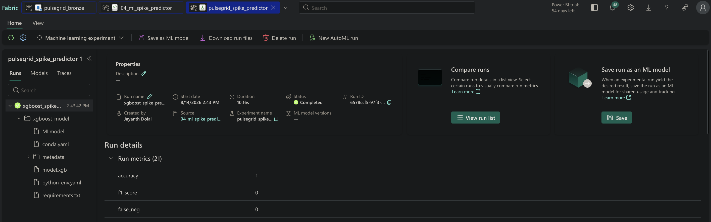

---

### 4.5 SHAP Explainability

**Storage format:** Long format — one row per `(region, event_time, feature_name)`.

This enables the AI agent to query: *"What were the top 3 factors driving the spike prediction for DE at 18:00?"* — answered by filtering `gold_shap_values` by region + event_time and ordering by `abs(shap_value) DESC`.

| Column | Description |
|---|---|
| `region` | Market zone |
| `event_time` | Prediction timestamp |
| `feature_name` | Feature identifier |
| `shap_value` | Positive = pushed toward spike, Negative = pushed toward non-spike |
| `feature_value` | Actual feature value at prediction time |

---

### 4.6 Validation Results

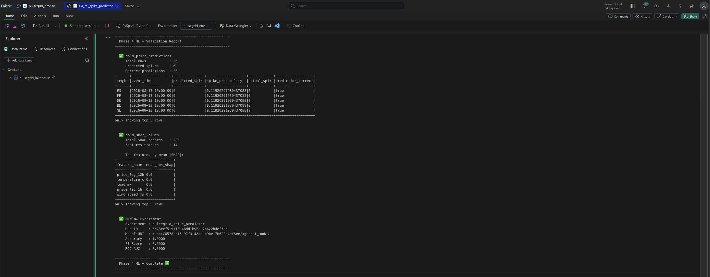
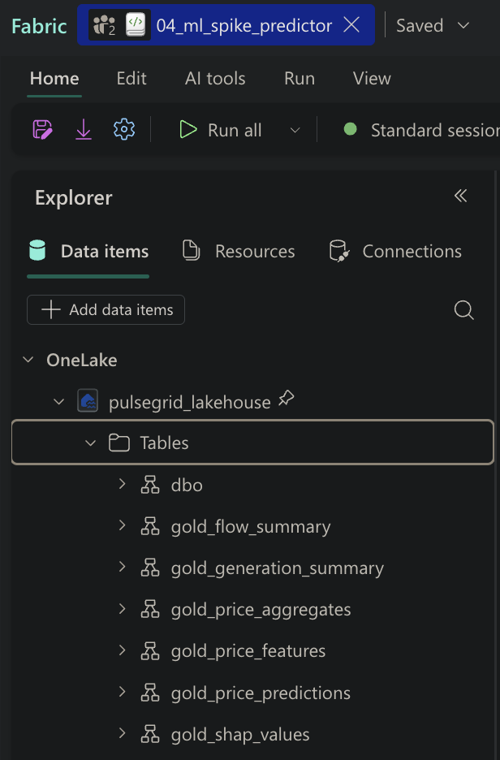

| Output | Value | Notes |
|---|---|---|
| `gold_price_predictions` rows | 20 | 20% test set of 66 Gold records |
| Correct predictions | 20 / 20 | Expected — 0 spikes in current data |
| `gold_shap_values` rows | 280 | 20 records × 14 features |
| MLflow Run ID | `6578ccf5-97f3-48dd-b9be-7b622b4ef5ee` | Completed, model artifact saved |
| Accuracy | 1.0000 | Trivially correct — single class (no spikes yet) |
| F1 Score | 0.0000 | Undefined — no positive class in test set |
| ROC AUC | 0.0000 | Undefined — single class in test set |
| SHAP mean abs | 0.0 | All zero — no class separation to explain yet |

**Note on metrics:** All metrics reflect the seed data state — only 2 days of live data with no price spikes. Once pollers accumulate several days of data with real European price spikes, rerunning this notebook produces meaningful SHAP values and real F1/ROC scores. See §4.7 for the first production run, which did exactly that.

---

### 4.7 Production Run — First Run With Real Spikes

Once the pollers had accumulated enough data for the p90 threshold to separate a real positive class, the notebook was rerun. This is the run whose output is published to the Streamlit snapshot.

**MLflow Run ID:** `9c0e9b3e-b8fd-4387-90fd-92fdf1ac37f1`
**Scored rows:** 530 across 27 bidding zones · **Window:** 2026-08-14 17:00 → 22:00

| Metric | Value |
|---|---|
| Accuracy | 0.723 (383 / 530) |
| Precision | 0.736 |
| Recall | 0.407 |
| F1 score | 0.524 |
| True positives | 81 |
| False positives | 29 |
| False negatives | 118 |
| True negatives | 302 |

**Reading the confusion matrix.** High precision with modest recall means the model rarely cries wolf but does miss marginal spikes. For an alerting surface that is the correct asymmetry — a false alarm costs an operator's attention, a missed marginal spike costs very little. Recall improves as more history accumulates and the lag features stop being null for early records per region.

**SHAP — mean |SHAP| across all 7,700 published explanations:**

| Feature | Mean \|SHAP\| |
|---|---|
| `price_eur_mwh` | 1.8872 |
| `price_rolling_avg_6h` | 1.6718 |
| `price_lag_1h` | 0.7731 |
| `price_lag_24h` | 0.6710 |
| `price_rolling_std_6h` | 0.6691 |
| `price_lag_12h` | 0.5576 |
| `hour_of_day` | 0.5253 |
| `load_mw` | 0.0284 |
| `day_of_week` | 0.0035 |
| `wind_speed_ms`, `temperature_c`, `solar_radiation`, `is_weekend`, `humidity_pct` | 0.0000 |

Price level, recent 6-hour average and short lags carry the signal. The weather block contributes exactly zero — with two days of data there is no seasonal variance for the trees to split on, so those features are never selected. This is a data-volume finding, not a modelling defect, and it is visible directly in the app's driver chart.

---

### 4.8 Phase 4 Summary

| Item | Status |
|---|---|
| `04_ml_spike_predictor` notebook created | ✅ |
| Gold features loaded + null handling in Spark | ✅ |
| `persist()` + `toPandas()` at boundary applied | ✅ |
| Time-aware train/test split | ✅ |
| XGBoost model trained | ✅ |
| MLflow experiment logged (params + metrics + model) | ✅ |
| SHAP values computed + written to `gold_shap_values` | ✅ |
| Predictions written to `gold_price_predictions` | ✅ |
| Cache released with `unpersist()` | ✅ |


---

## Phase 5 — Power BI Semantic Model + Dashboard

### Objective

Create a Direct Lake Semantic Model on top of the Gold Delta tables and build a 5-visual Power BI dashboard for real-time energy market monitoring. Direct Lake mode reads directly from OneLake — no data movement, no import, no scheduled refresh needed.

---

### 5.1 Gold Table Registration

Before creating the Semantic Model, all Gold tables were registered in the Lakehouse metastore using `saveAsTable` (Cell 10 of `03_gold_features`). This is the Fabric-native registration method required for Direct Lake connectivity.

**Tables registered:**

| Table | Rows |
|---|---|
| `gold_price_features` | 66 |
| `gold_generation_summary` | 58 |
| `gold_flow_summary` | 44 |
| `gold_price_aggregates` | 84 |
| `gold_price_predictions` | 20 |
| `gold_shap_values` | 280 |

---

### 5.2 Semantic Model — `pulsegrid_semantic_model`

**Mode:** Direct Lake — reads directly from OneLake Delta tables. No import, no scheduled refresh, no data duplication.

**Tables included:**

| Table | Purpose |
|---|---|
| `gold_price_features` | Central fact table — ML features + spike labels |
| `gold_price_aggregates` | Hourly + daily price aggregates — trend visuals |
| `gold_price_predictions` | XGBoost predictions + probabilities |
| `gold_generation_summary` | Renewable/nuclear/fossil generation ratios |

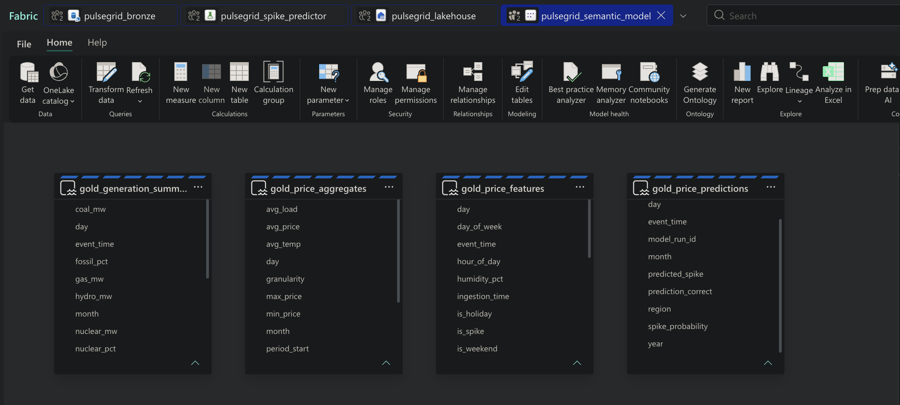

---

### 5.3 Relationships

3 active Many-to-Many relationships, all bidirectional cross-filter.

| From Table | Column | To Table | Column | Cardinality | Cross Filter |
|---|---|---|---|---|---|
| `gold_price_aggregates` | `region` | `gold_price_features` | `region` | Many to Many | Both |
| `gold_price_predictions` | `region` | `gold_price_features` | `region` | Many to Many | Both |
| `gold_generation_summary` | `region` | `gold_price_features` | `region` | Many to Many | Both |

**Design decision:** Region-only relationships — time columns not joined because `gold_price_aggregates` uses `period_start` (truncated hourly/daily) while `gold_price_features` uses raw `event_time`. Mismatched time granularities would produce incorrect cross-filter results. Time filtering handled via individual date slicers per visual.

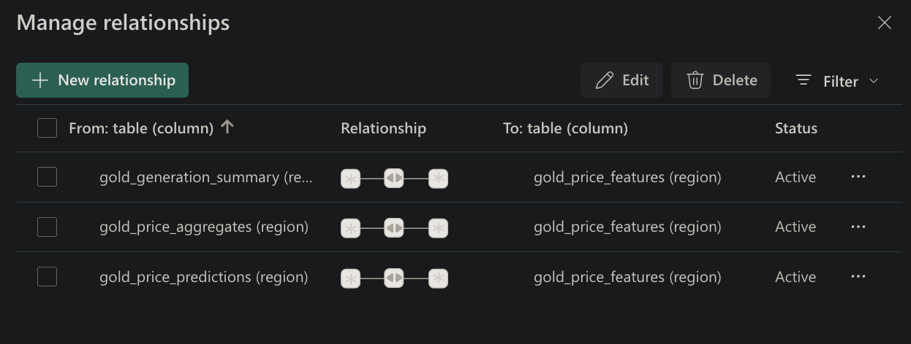

---

### 5.4 Power BI Dashboard — `PulseGrid — Energy Market Dashboard`

**Page:** Market Overview

**5 visuals built:**

| Visual | Type | Fields | Purpose |
|---|---|---|---|
| Region Slicer | Dropdown Slicer | `gold_price_features[region]` | Cross-filter all visuals by market zone |
| Average Price by Hour of Day | Line Chart | X: `hour_of_day`, Y: avg `price_eur_mwh` | Intraday price pattern |
| Price Trend (Hourly vs Daily) | Line Chart | X: `period_start`, Y: avg `avg_price`, Legend: `granularity` | Price trend comparison |
| Price Spike Predictions | Table | `region`, `event_time`, `predicted_spike`, `spike_probability`, `actual_spike` | Model output visibility |
| Renewable Generation % by Region | Clustered Bar Chart | Y: `region`, X: avg `renewable_pct` | Generation mix by zone |

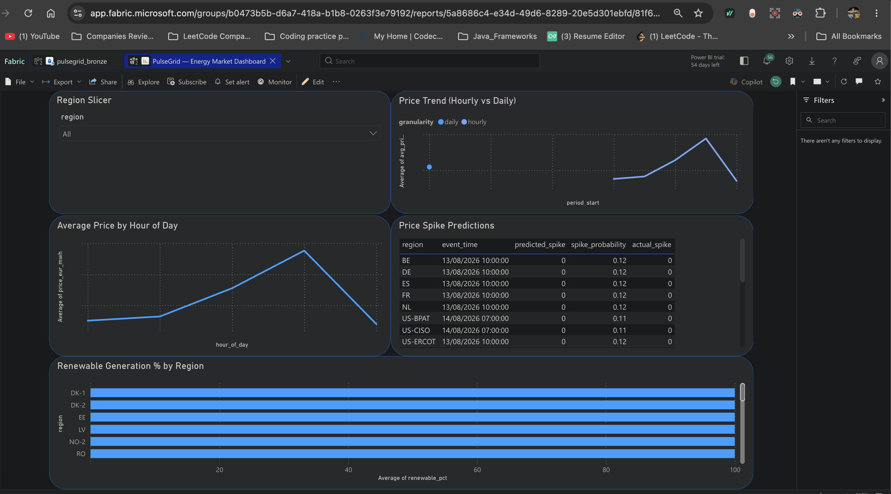

---

### 5.5 Phase 5 Summary

| Item | Status |
|---|---|
| Gold tables registered in Lakehouse metastore | ✅ |
| `pulsegrid_semantic_model` created (Direct Lake) | ✅ |
| 3 active bidirectional relationships | ✅ |
| Region Slicer cross-filtering all visuals | ✅ |
| 5 visuals built and validated | ✅ |
| Report saved as `PulseGrid — Energy Market Dashboard` | ✅ |


---

## Phase 6 — AI Analyst (Claude API + Streamlit)

### Objective

Ship a public, credential-free analytics surface over the Gold layer: a market dashboard anyone can open, plus a Claude-powered analyst that answers plain-English questions grounded in the real Gold tables. Deployed on Streamlit Community Cloud at **https://pulsegrid-energy.streamlit.app/**.

---

### 6.1 The Snapshot Problem — and the Decision

The obvious design is for the app to query the Fabric Lakehouse live. It does not work for a public deployment:

| Problem | Consequence |
|---|---|
| Fabric bearer tokens expire in roughly an hour | A deployed app breaks mid-session with no way to re-auth |
| Service-principal auth against a Trial capacity | Not available; and it would put a secret in a public app |
| SQL endpoint latency on cold Trial capacity | Multi-second page loads on every interaction |

**Decision:** publish the Gold tables the app reads as JSON, committed to this repo. The app then has **zero runtime auth dependency** and loads instantly from disk.

**Implementation — `03_gold_features` Cell 11.** Reads each Delta table, serialises to a JSON records string in memory, and pushes straight to the GitHub contents API (`PUT /repos/{repo}/contents/{path}` with the current blob SHA for updates). The PAT lives in `pulsegrid_env` as `spark.pulsegrid.github_token`, never inline.

**Why in-memory and not via the Lakehouse Files area.** The earlier version wrote JSON with `mssparkutils.fs.put` and read it back with `fs.head` to push. `fs.head` is hard-capped at 100 KB regardless of the `maxBytes` argument, so every table over that cap was truncated mid-record and became invalid JSON:

```
gold_price_aggregates.json    102,400 bytes  <- cut off
gold_price_predictions.json   102,400 bytes  <- cut off
gold_shap_values.json         102,400 bytes  <- cut off
gold_generation_summary.json   56,482 bytes  <- under the cap, fine
```

`pandas.read_json` raised on the three truncated files, the app fell back to empty DataFrames, and every metric rendered as 0 — only the generation mix, the one table under the cap, displayed. Serialising in memory removes the round trip and the cap.

**Tables published:** `gold_price_aggregates`, `gold_price_predictions`, `gold_shap_values`, `gold_generation_summary`.

---

### 6.2 Application Structure

| File | Role |
|---|---|
| `streamlit/app.py` | Entry point — page config, top-bar brand + nav + reload, routing |
| `streamlit/lib/data.py` | Snapshot loader, derived views, freshness, Claude context builder |
| `streamlit/lib/theme.py` | Design tokens, injected CSS, shared Plotly template, custom components |
| `streamlit/views/dashboard.py` | Market dashboard |
| `streamlit/views/agent.py` | Claude analyst chat |
| `streamlit/views/about.py` | Architecture reference page |

**Navigation.** `st.navigation(pages, position="hidden")` suppresses Streamlit's sidebar nav; the brand, page links and reload action are rendered manually in a top bar and the sidebar is hidden in CSS. Dashboard apps read better with a top bar than a collapsible side panel.

**Caching.** `@st.cache_data(ttl=600)` on every table read. The **Reload snapshot** button calls `st.cache_data.clear()` then `st.rerun()`.

**Resilience.** `load_table()` tries four candidate paths and returns an empty DataFrame on a missing or malformed file rather than raising — callers render an empty state, so a bad publish degrades the page instead of crashing it.

---

### 6.3 Dashboard Page

| Element | What it shows |
|---|---|
| KPI row | Zones priced, mean price, peak zone, spike alerts, renewable share, SHAP record count |
| Zone price board | One bar per bidding zone, high → low, coloured by cross-zone price percentile |
| Price movement | Multi-select hourly price curve per zone |
| Spike watchlist | Latest prediction per zone, highest probability first |
| Zone spread | Min–max price band per zone with the average marked |
| Generation mix | Stacked renewable / nuclear / fossil share per reporting zone |
| Model drivers | Mean absolute SHAP per feature, filterable by zone |

**Zones reporting nothing are excluded, not drawn.** ENTSO-E publishes a row for every zone on every interval; many TSOs report nothing for the current window and arrive as 0 MW across all fuels. `active_generation()` filters `total_generation_mw > 0` so the chart shows 11 real zones rather than a wall of empty bars.

**Future timestamps are clamped, not reported negative.** Day-ahead prices carry future delivery timestamps, so the newest record can legitimately sit ahead of now; `freshness()` clamps the computed age at zero.

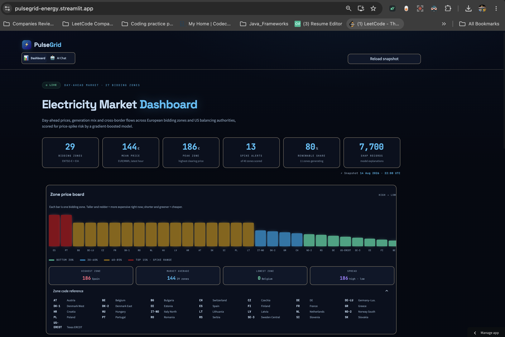
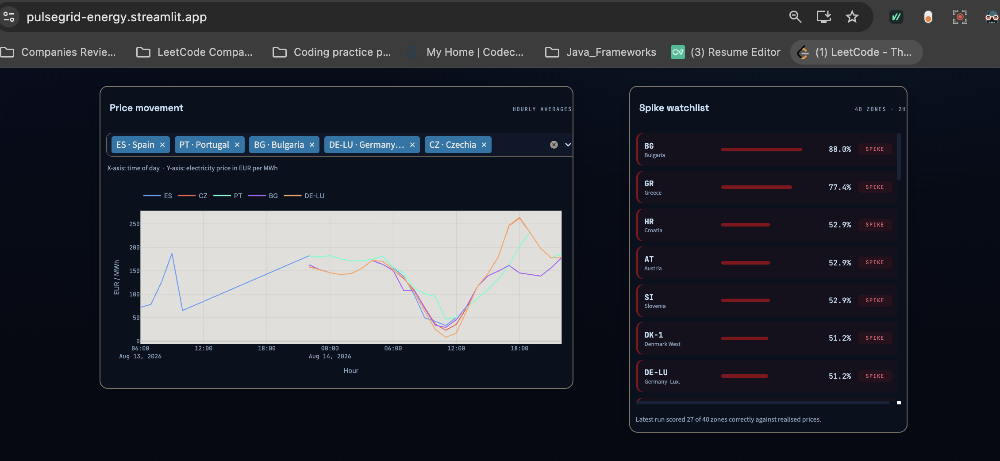
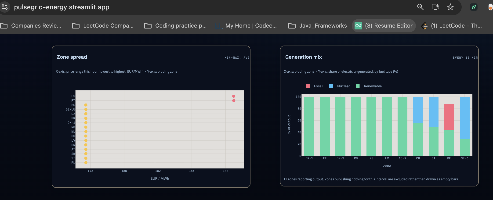
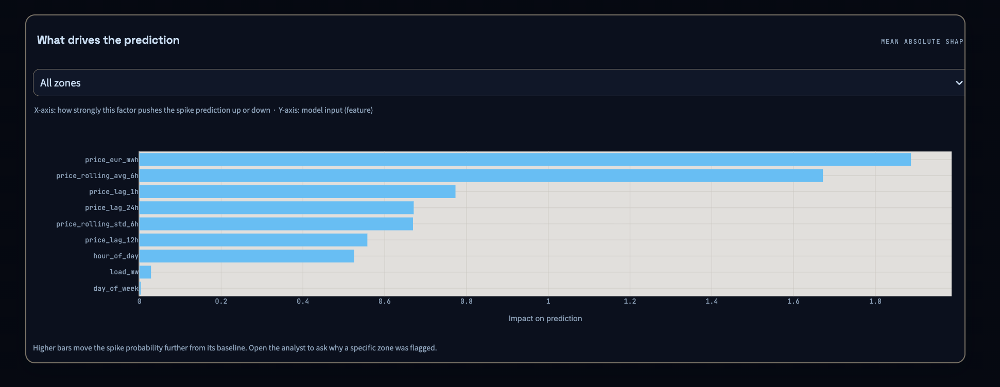
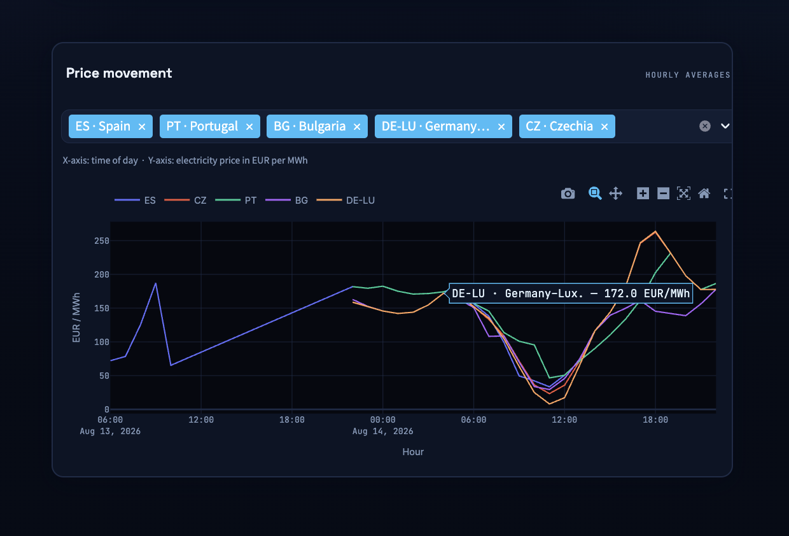

---

### 6.4 Claude Analyst

**Grounding.** `build_context()` assembles a compact market summary — latest price per zone, spike predictions, generation mix, and mean-absolute SHAP importance — and injects it into the system prompt. Aggregates are sent, not raw rows; the model needs the current state of the market, not 7,700 SHAP records.

**System prompt rules:**
- Quote real figures from the snapshot; prices in EUR/MWh, load in MW, shares in %
- When explaining a spike, name the SHAP drivers and the direction each pushed the probability
- Refer to zones by code *and* name, e.g. "DE-LU (Germany–Luxembourg)"
- If the snapshot lacks the answer, name the Gold table that would hold it and when it refreshes — never invent a number

**Streaming.** Replies stream through `client.messages.stream()` into a placeholder inside the scrollable history container, so the answer appears token by token without a second rerun. On failure the user turn is popped so the thread stays consistent.

**Degradation without a key.** `ANTHROPIC_API_KEY` is read from `st.secrets`. If absent, the chat page renders a setup empty-state and the dashboard continues to work — the app is never fully blocked by a missing credential.

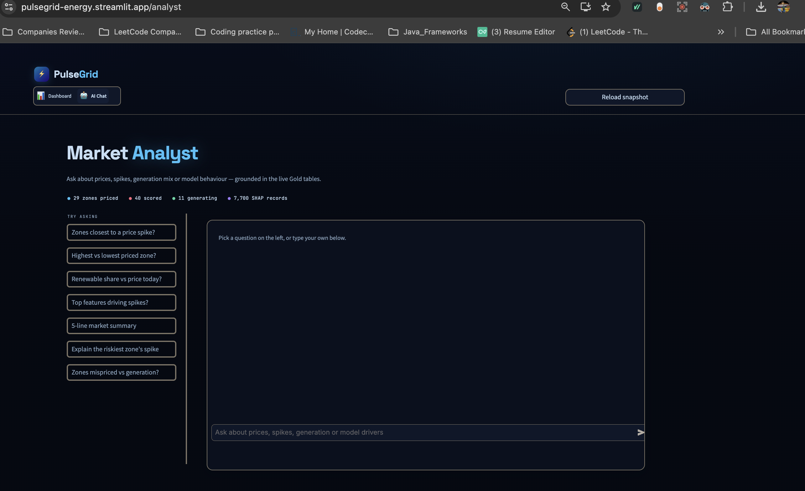
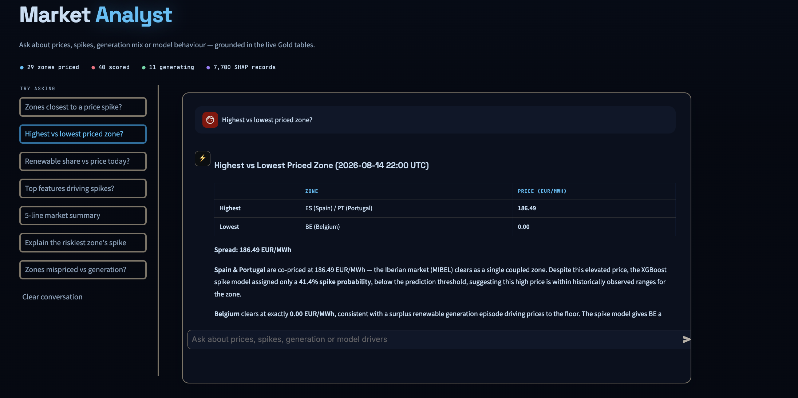

---

### 6.5 Deployment

| Item | Value |
|---|---|
| Host | Streamlit Community Cloud |
| URL | https://pulsegrid-energy.streamlit.app/ |
| Entry point | `streamlit/app.py` |
| Dependencies | `streamlit 1.40.0`, `anthropic 0.40.0`, `httpx 0.27.2`, `pandas 2.2.2`, `plotly 5.20.0` |
| Secrets | `ANTHROPIC_API_KEY` under App settings → Secrets |
| Theme | `.streamlit/config.toml` — dark base, `#38BDF8` primary on `#060B16` |
| Data refresh | Automatic on each `03_gold_features` run (hourly) via the Cell 11 GitHub push |

---

### 6.6 Phase 6 Summary

| Item | Status |
|---|---|
| Gold snapshot publisher (Cell 11) rewritten to bypass the 100 KB `fs.head` cap | ✅ |
| Snapshot committed to repo — app has no runtime auth dependency | ✅ |
| Dashboard with 6 KPIs and 6 analytical panels | ✅ |
| Claude analyst grounded in live Gold context, streaming replies | ✅ |
| Graceful degradation without an API key | ✅ |
| Deployed publicly on Streamlit Community Cloud | ✅ |

---

## Phase 7 — Orchestration & Monitoring

### Objective

Take the six notebooks off manual execution. Each is wrapped in a Fabric Data Pipeline with its own schedule and failure notification, and Bronze ingestion is watched by an Activator rule so a silent poller failure surfaces as an email rather than as a stale dashboard nobody noticed.

---

### 7.1 Pipelines

Each pipeline contains a single **Notebook** activity bound to the `PulseGrid` workspace, with failure email notification enabled.

| Pipeline | Notebook | Schedule | Time Zone |
|---|---|---|---|
| `pipeline_01a_daily_price` | `01a_daily_price_poller` | Daily 13:00 | UTC+01:00 CET |
| `pipeline_01b_realtime` | `01b_realtime_poller` | Every 15 minutes | UTC+01:00 CET |
| `pipeline_01c_weather_eia` | `01c_weather_eia_poller` | Every 30 minutes | UTC+01:00 CET |
| `pipeline_02_silver` | `02_silver_cleansing` | Every 30 minutes | UTC+01:00 CET |
| `pipeline_03_gold` | `03_gold_features` | Every 1 hour | UTC+01:00 CET |
| `pipeline_04_ml` | `04_ml_spike_predictor` | Daily 02:00 | UTC+01:00 CET |

**Max concurrency is 1 on every schedule.** Fabric Trial capacity returns a 430 error when Spark sessions overlap; serialising each pipeline against itself keeps a slow run from stacking on the next tick.

**Cadence rationale.** Silver runs at 30 minutes because that is the fastest cadence at which every Bronze table has something new (the 15-minute realtime poller writes twice per Silver run, which the idempotent MERGE absorbs). Gold runs hourly because the aggregates are hour-grained — running faster would recompute identical rows. The ML notebook retrains daily at 02:00 CET, off-peak for both the market and the Trial capacity.

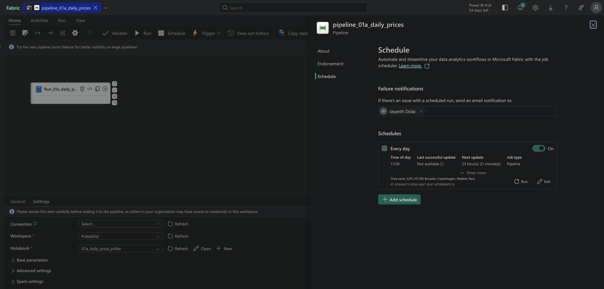
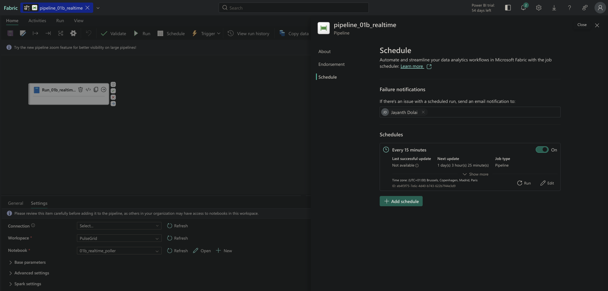
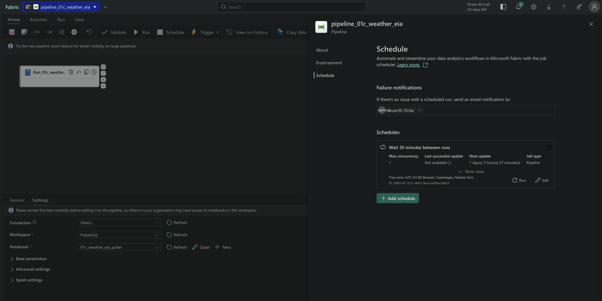
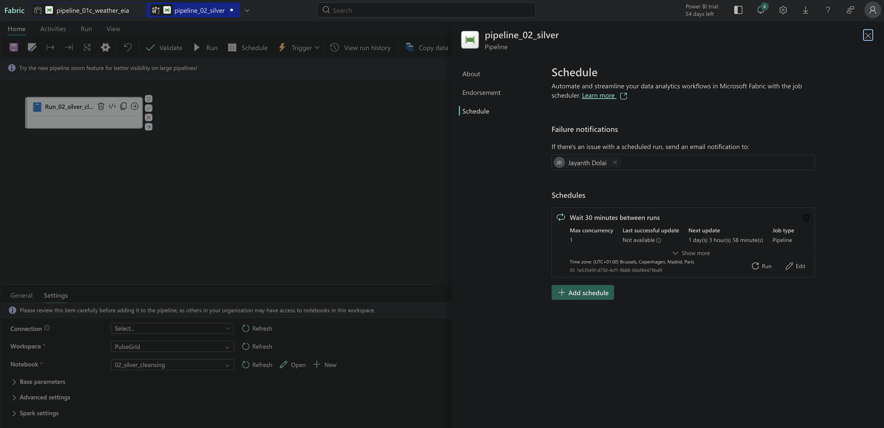
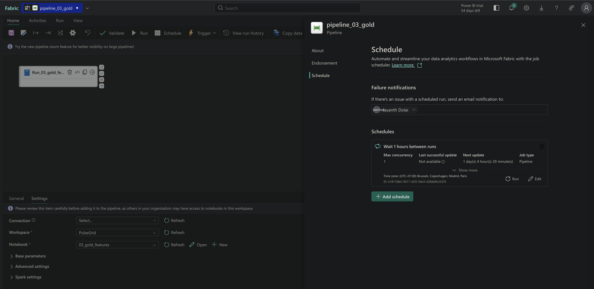
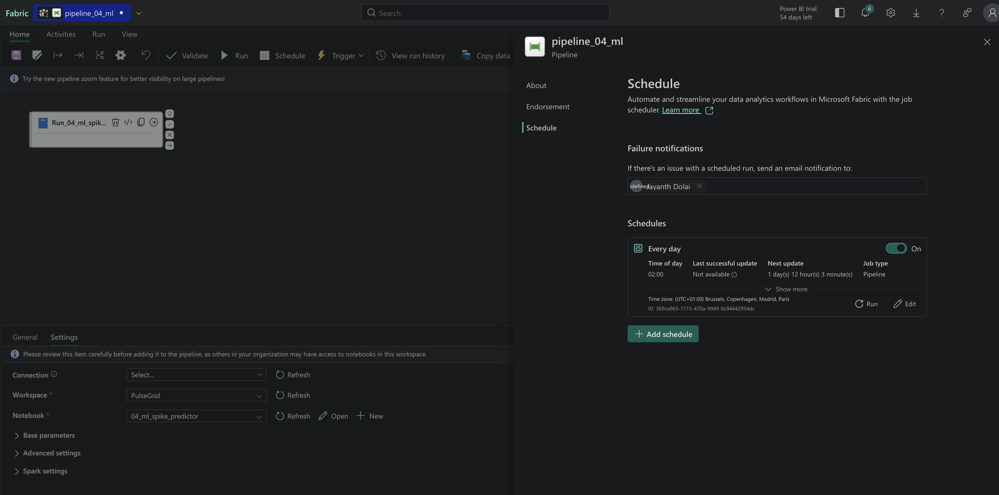

---

### 7.2 Library Management — Why `%pip` Had To Go

`%pip install` magic is disabled in pipeline-triggered notebook runs. Every dependency moved into the `pulsegrid_env` Environment as a public library, pinned to versions that resolve against the Spark runtime's Python 3.10 — notably `xgboost < 3.3`, since 3.3 and above require Python 3.12 and will not install there.

---

### 7.3 Freshness Alert — `pulsegrid_bronze_freshness_alert`

A Fabric Activator rule monitoring the `pulsegrid_bronze` KQL database.

```kusto
raw_electricity_prices
| where ingestion_time > ago(2h)
| count
| where Count == 0
```

| Setting | Value |
|---|---|
| Source | `pulsegrid_bronze` |
| Run query every | 30 minutes |
| Condition | On each event |
| Action | Message to individuals — email |
| Headline | PulseGrid — Bronze Data Freshness Alert |
| Notes | No electricity price data received in Bronze in the last 2 hours. Check pollers 01a/01b/01c in Fabric. |
| Saved in | `PulseGrid` workspace |

**Why this specific check.** A real-time platform's worst failure is not a crash — it is a poller that quietly stops writing while every downstream surface keeps rendering the last good numbers. Pipeline failure emails cover the case where a run errors; this rule covers the case where runs succeed but produce nothing. The two-hour window is wider than the slowest ingest cadence (30 minutes) so a single skipped run does not page anyone.

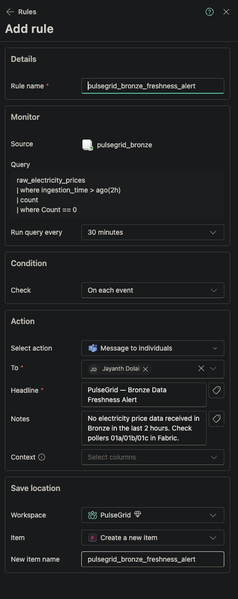

---

### 7.4 Phase 7 Summary

| Item | Status |
|---|---|
| 6 Fabric Data Pipelines created, one per notebook | ✅ |
| Schedules matched to each layer's natural cadence | ✅ |
| Max concurrency 1 — avoids Trial 430 capacity errors | ✅ |
| Failure email notification on every pipeline | ✅ |
| Dependencies moved from `%pip` into `pulsegrid_env` libraries | ✅ |
| Bronze freshness Activator rule live on a 30-minute check | ✅ |

---

## Appendix A — Spark Optimization Techniques

| Technique | Phase | Rationale |
|---|---|---|
| Predicate pushdown on `ingestion_date`, `region` | Silver | Avoids full scan; leverages KQL + Delta file skipping |
| Native Spark functions only (no UDFs) | Silver | Catalyst can optimize; no serialization overhead |
| `repartition()` by `region` + `hour` | Silver | Aligns write partitions to Gold aggregation patterns |
| Parallel processing via `ThreadPoolExecutor` | Silver | All 5 tables simultaneously; total time ≈ slowest table |
| Window function dedup `row_number()` | Silver | Deterministic dedup; fully distributed; no `collect()` |
| `broadcast()` hint on holidays table | Gold | ~300 row table; eliminates shuffle on large price table |
| Window functions for lag features | Gold | Fully distributed lag computation; no `collect()` |
| AQE (Adaptive Query Execution) | Gold | Post-shuffle partition coalescing on aggregations |
| `cache()` on feature table | ML | Feature table read twice; avoids re-scan |
| `persist(MEMORY_AND_DISK)` before train/test split | ML | Split computed twice otherwise |
| Delta `OPTIMIZE` + `ZORDER BY (region, event_time)` | Gold | Improves read performance for Semantic Model + agent |
| `partitionBy("year","month","day")` at write | Silver/Gold | Right-sized partitioning; avoids small-files problem |

---

## Appendix B — ENTSO-E Bidding Zone Codes (27 Zones)

| Region | Zone Key |
|---|---|
| FR | 10YFR-RTE------C |
| ES | 10YES-REE------0 |
| NL | 10YNL----------L |
| BE | 10YBE----------2 |
| PL | 10YPL-AREA-----S |
| AT | 10YAT-APG------L |
| CH | 10YCH-SWISSGRIDZ |
| PT | 10YPT-REN------W |
| FI | 10YFI-1--------U |
| CZ | 10YCZ-CEPS-----N |
| SK | 10YSK-SEPS-----K |
| HU | 10YHU-MAVIR----U |
| RO | 10YRO-TEL------P |
| BG | 10YCA-BULGARIA-R |
| HR | 10YHR-HEP------M |
| GR | 10YGR-HTSO-----Y |
| SI | 10YSI-ELES-----O |
| RS | 10YCS-SERBIATSOV |
| LT | 10YLT-1001A0008Q |
| LV | 10YLV-1001A00074 |
| DE-LU | 10Y1001A1001A82H |
| IT-NO | 10Y1001A1001A73I |
| DK-1 | 10YDK-1--------W |
| DK-2 | 10YDK-2--------M |
| SE-3 | 10Y1001A1001A46L |
| NO-2 | 10YNO-2--------T |
| EE | 10Y1001A1001A39I |

---

*Last updated: Phase 7 complete — all phases delivered · August 2026*

---
