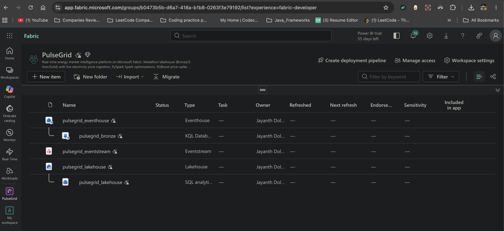
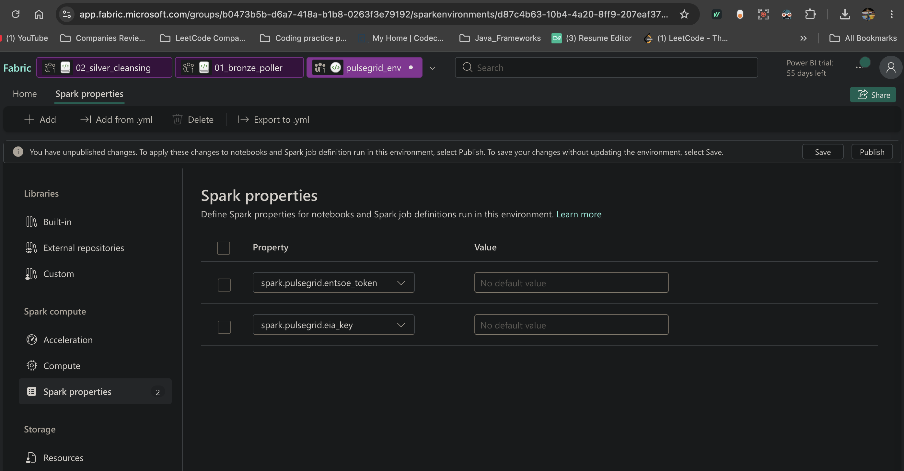
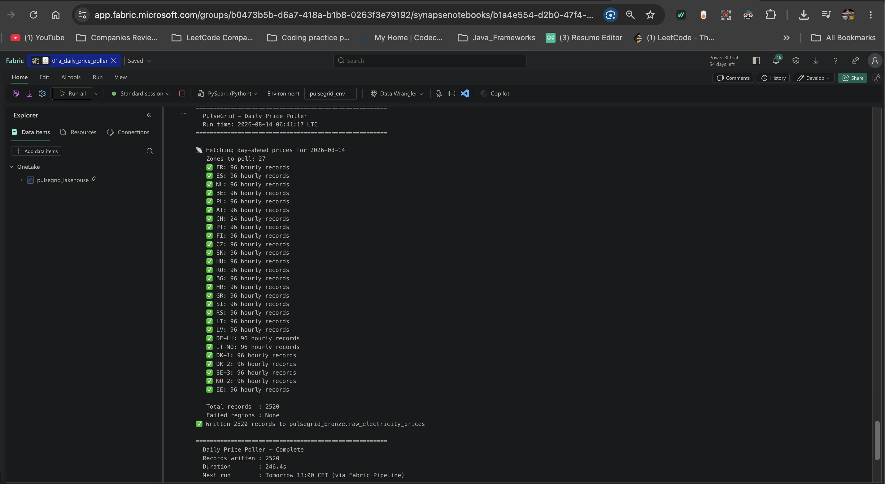
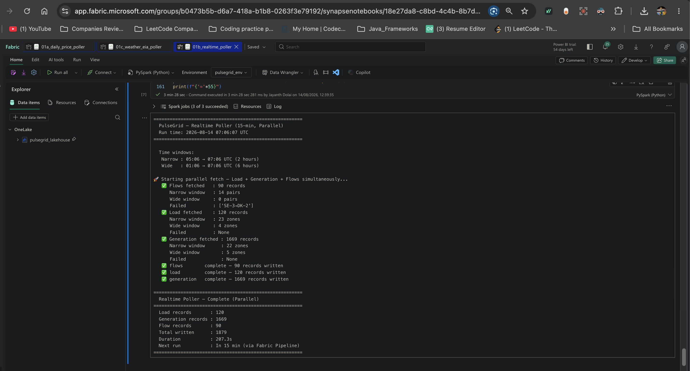
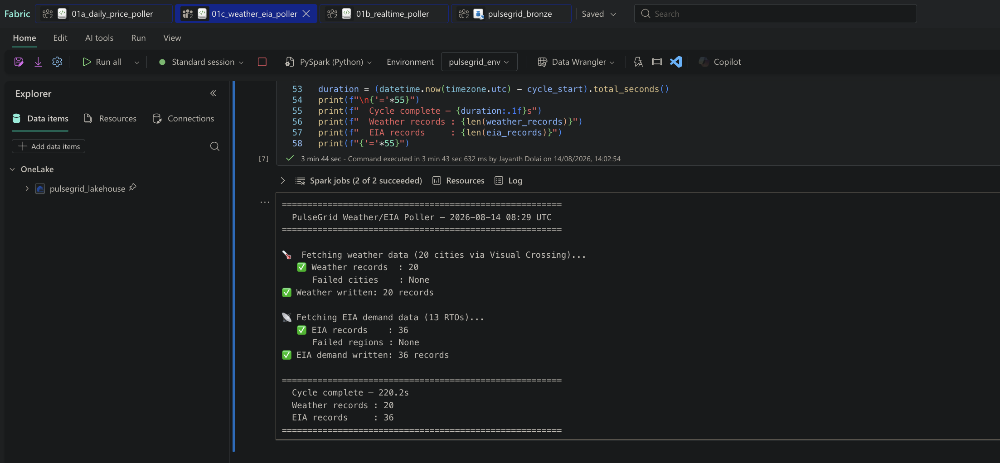
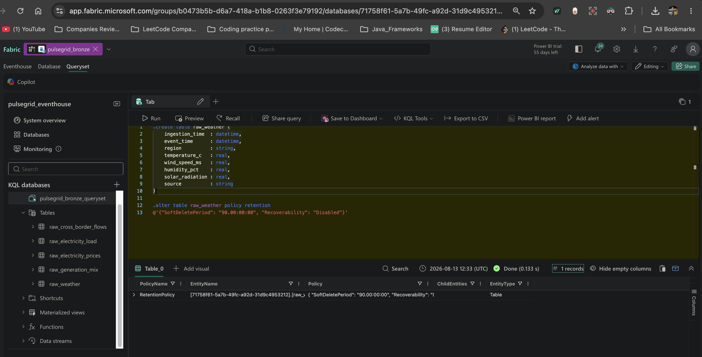
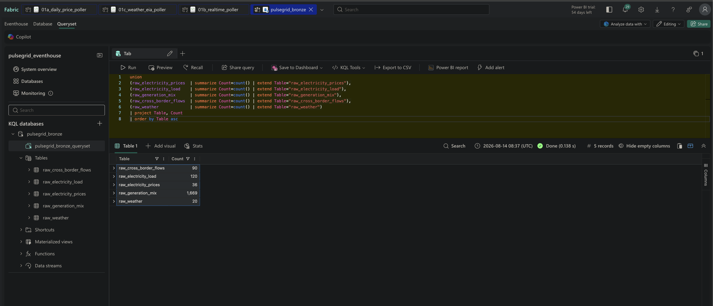
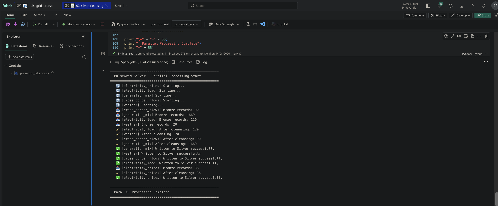
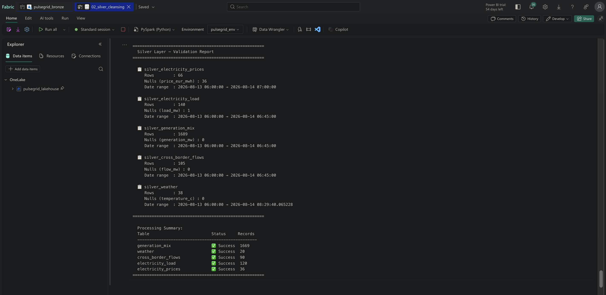

# PulseGrid — Technical Specification

> Phase-by-phase engineering implementation journal for the PulseGrid Real-Time Energy Market Intelligence Platform on Microsoft Fabric.

---

## Document Purpose

This document serves as the authoritative technical reference for the PulseGrid project. It records every implementation decision, configuration, code, and validation step across all phases — providing full traceability from raw ingestion to AI-powered analytics.

---

## Platform Constraints & Design Decisions

| Constraint | Decision |
|---|---|
| Microsoft Fabric Trial | All components scoped to Trial-available features only |
| No Fabric Data Agent | Claude API + Streamlit used as the AI agent layer |
| Spark network restrictions | Open-Meteo blocked — replaced with Visual Crossing Weather API |
| Trial Spark capacity (430 limit) | Pollers run sequentially, not simultaneously |
| Free API tier limits | Event-aligned polling — each source polled at its actual update frequency |
| API key security | Fabric Environment Spark properties — keys never hardcoded in notebooks or Git |
| Trial storage limits | 90-day retention, recoverability disabled on all KQL tables |

---

## Phase 1 — Bronze Layer (Data Ingestion)

### Objective

Establish the real-time ingestion foundation. Raw electricity market data from four public APIs lands into a KQL Database as the Bronze layer — append-only, no transformations, schema-on-read. Five dedicated tables capture prices, load, generation mix, cross-border flows, and weather.

---

### 1.1 Fabric Workspace Setup

**Workspace:** `PulseGrid` — Microsoft Fabric Trial.

**Items provisioned:**

| Item | Type | Role |
|---|---|---|
| `pulsegrid_eventhouse` | Eventhouse | Container for KQL databases |
| `pulsegrid_bronze` | KQL Database | Bronze raw data store |
| `pulsegrid_eventstream` | Eventstream | Real-time ingestion pipeline (reserved) |
| `pulsegrid_lakehouse` | Lakehouse | Silver + Gold Delta store |
| `pulsegrid_env` | Environment | API key store + library management |

---

### 1.2 Fabric Environment — Secret Management

**Environment:** `pulsegrid_env` — stores all API credentials as Spark properties.

| Property | Source |
|---|---|
| `spark.pulsegrid.entsoe_token` | ENTSO-E Transparency Platform |
| `spark.pulsegrid.eia_key` | EIA Open Data |
| `spark.pulsegrid.visualcrossing_key` | Visual Crossing Weather API |

---

### 1.3 API Registration & Rate Limits

| Source | Limit | Daily Usage | Headroom |
|---|---|---|---|
| ENTSO-E | 400 req/min per token | ~6,500 calls | 99% |
| EIA | Throttled/hour (unpublished) | ~624 calls | Conservative |
| Visual Crossing | 1,000 records/day | 960 records | 4% |
| Open-Meteo | 10,000 calls/day | **Blocked on Fabric** | N/A |

**Open-Meteo finding:** Fabric Trial Spark executors block outbound HTTP to `api.open-meteo.com`. Visual Crossing used as replacement — confirmed reachable from Fabric.

---

### 1.4 Rate Limiting Strategy — Event-Aligned Polling

| Notebook | Schedule | Sources | Tables Written |
|---|---|---|---|
| `01a_daily_price_poller` | Once/day at 13:00 CET | ENTSO-E day-ahead prices (27 zones) | `raw_electricity_prices` |
| `01b_realtime_poller` | Every 15 min | ENTSO-E load + generation + cross-border | `raw_electricity_load`, `raw_generation_mix`, `raw_cross_border_flows` |
| `01c_weather_eia_poller` | Every 30 min | Visual Crossing (20 cities) + EIA (13 RTOs) | `raw_weather`, `raw_electricity_prices` |

**Additional protections:**
- Exponential backoff with jitter on every API call
- `NoMatchingDataError` skipped immediately — no retries on missing data
- Two-stage fetch in `01b`: narrow 30-min window first, wide 6-hour fallback for slow TSOs
- Arrow optimization disabled for nullable float64 columns
- Sequential poller execution — Fabric Trial 430 error triggered on simultaneous runs

---

### 1.5 Poller Results — First Live Run

| Poller | Records Written | Duration | Failed |
|---|---|---|---|
| `01a` — ENTSO-E prices | 2,520 (27/27 zones) | 246.4s | None |
| `01b` — load + generation + flows | 1,879 | 207.3s | SE-3→DK-2 flow (unavailable) |
| `01c` — weather + EIA | 56 (20 cities + 13 RTOs) | 220.2s | None |

---

### 1.6 Bronze Tables — Live Record Counts

| Table | Records | Frequency |
|---|---|---|
| `raw_electricity_prices` | 2,556 | Once/day + every 30 min |
| `raw_electricity_load` | 120 | Every 15 min |
| `raw_generation_mix` | 1,669 | Every 15 min |
| `raw_cross_border_flows` | 90 | Every 15 min |
| `raw_weather` | 20 | Every 30 min |
| **Total** | **4,455** | |

---

### 1.7 Phase 1 Summary

| Item | Status |
|---|---|
| Fabric workspace + all items provisioned | ✅ |
| 3 API keys registered + stored in Environment | ✅ |
| All 5 Bronze KQL tables + retention policies | ✅ |
| 3 pollers running with live data | ✅ |
| Open-Meteo blocked → Visual Crossing substituted | ✅ |
| Total Bronze records: 4,455 | ✅ |

---

## Phase 2 — Silver Layer (Parallel PySpark Cleansing)

### Objective

Read all 5 Bronze KQL tables into Spark, apply table-specific cleansing rules and Spark optimizations, and write clean Delta tables to the Silver layer of `pulsegrid_lakehouse`. All 5 tables processed in parallel using `ThreadPoolExecutor` — total execution time equals the slowest single table, not the sum.

---

### 2.1 Notebook — `02_silver_cleansing`

**Environment:** `pulsegrid_env` attached. **Default lakehouse:** `pulsegrid_lakehouse`.

**Structure:**

| Cell | Purpose |
|---|---|
| Cell 1 | Imports, config, Silver paths, parallel worker count |
| Cell 2 | Generic KQL Bronze reader with predicate pushdown |
| Cell 3 | Table-specific cleansing functions (5 tables) |
| Cell 4 | Generic Silver Delta writer — idempotent MERGE |
| Cell 5 | Parallel executor — ThreadPoolExecutor (MAX_WORKERS=5) |
| Cell 6 | Validation — all 5 Silver tables |

---

### 2.2 Spark Optimizations Applied

| Technique | Where | Rationale |
|---|---|---|
| **Predicate pushdown** | Cell 2 — KQL reader | `ago(7d)` filter executes on KQL engine before Spark ingestion — reduces data transferred across wire |
| **Native functions only (no UDFs)** | Cell 3 — all cleansing | `F.when`, `F.coalesce`, `F.upper`, `F.trim`, `F.to_timestamp` — Catalyst-visible, no Python↔JVM serialization |
| **Window function dedup** | Cell 3 — `deduplicate()` | `row_number()` over natural key ordered by `ingestion_time DESC` — fully distributed, no `collect()` |
| **`repartition()` by region + hour** | Cell 3 — `add_partitions_and_repartition()` | Aligns Spark partitions with Gold aggregation access patterns |
| **`partitionBy(year, month, day)`** | Cell 4 — writer | Right-sized Delta partitioning — avoids small-files problem from 5-min tick writes |
| **Idempotent MERGE** | Cell 4 — writer | Safe for reruns and pipeline retries — natural key match, update existing + insert new |
| **Parallel ThreadPoolExecutor** | Cell 5 | All 5 tables run simultaneously — total time ≈ slowest table (not sum) |

---

### 2.3 Cleansing Rules Per Table

**`silver_electricity_prices`**
- Nullify `price_eur_mwh` outside [-500, 5000] EUR/MWh (European markets allow negative prices during oversupply)
- Nullify negative `load_mw` (physically impossible)
- Fill null `temperature_c` with 0.0
- Normalize `region` to uppercase
- Deduplicate on `(region, event_time)`

**`silver_electricity_load`**
- Nullify `load_mw` ≤ 0 or > 1,000,000 MW (data errors)
- Normalize `region` to uppercase
- Deduplicate on `(region, event_time)`

**`silver_generation_mix`**
- Nullify negative `generation_mw`
- Normalize `fuel_type` to title case (`wind onshore` → `Wind Onshore`)
- Deduplicate on `(region, event_time, fuel_type)`

**`silver_cross_border_flows`**
- Normalize `from_region` and `to_region` to uppercase
- Remove self-flows (`from_region == to_region` — data error)
- Note: negative `flow_mw` is valid (import direction)
- Deduplicate on `(from_region, to_region, event_time)`

**`silver_weather`**
- `temperature_c`: valid range [-60, 60] °C
- `wind_speed_ms`: non-negative, cap at 100 m/s
- `humidity_pct`: valid range [0, 100] %
- `solar_radiation`: non-negative, cap at 1,500 W/m²
- Fill all nulls with 0.0 (sensor outage fallback)
- Deduplicate on `(region, event_time)`

---

### 2.4 Parallel Execution Results

All 5 tables processed simultaneously. Execution order determined by Spark job completion, not submission order.

| Table | Bronze Records | Silver Records | Status |
|---|---|---|---|
| `electricity_prices` | 36 | 66 | ✅ |
| `electricity_load` | 120 | 140 | ✅ |
| `generation_mix` | 1,669 | 1,689 | ✅ |
| `cross_border_flows` | 90 | 105 | ✅ |
| `weather` | 20 | 38 | ✅ |

> Silver row counts are higher than Bronze for some tables because Silver picked up both the initial live run and the previously cleared seed data remnants that were still within the 7-day KQL filter window. Deduplication on natural key ensured no duplicate records in Silver.

---

### 2.5 Silver Validation Report

| Table | Rows | Nulls | Date Range |
|---|---|---|---|
| `silver_electricity_prices` | 66 | 36 (EIA records — no price, load only) | 2026-08-13 → 2026-08-14 |
| `silver_electricity_load` | 140 | 1 (invalid value nullified) | 2026-08-13 → 2026-08-14 |
| `silver_generation_mix` | 1,689 | 0 | 2026-08-13 → 2026-08-14 |
| `silver_cross_border_flows` | 105 | 0 | 2026-08-13 → 2026-08-14 |
| `silver_weather` | 38 | 0 | 2026-08-13 → 2026-08-14 |

**Notes on nulls:**
- `silver_electricity_prices` — 36 nulls on `price_eur_mwh` are EIA demand records. EIA provides load (MW) only, not price. Expected and correct.
- `silver_electricity_load` — 1 null on `load_mw` — one Bronze record had an invalid value, correctly nullified by cleansing rule.

---

### 2.6 Phase 2 Summary

| Item | Status |
|---|---|
| `02_silver_cleansing` notebook created | ✅ |
| All 5 Bronze tables read via KQL connector | ✅ |
| Parallel ThreadPoolExecutor — 5 workers | ✅ |
| All Spark optimizations applied | ✅ |
| All 5 Silver Delta tables written | ✅ |
| Idempotent MERGE validated | ✅ |
| Data quality validation passed | ✅ |

---

## Phase 3 — Gold Layer (Feature Engineering)

> 🔄 In Progress — details will be added upon completion.

---

## Phase 4 — ML (XGBoost Spike Predictor)

> ⬜ Pending

---

## Phase 5 — Power BI Semantic Model

> ⬜ Pending

---

## Phase 6 — AI Agent (Claude API + Streamlit)

> ⬜ Pending

---

## Appendix A — Spark Optimization Techniques

| Technique | Phase | Rationale |
|---|---|---|
| Predicate pushdown on `ingestion_date`, `region` | Silver | Avoids full scan; leverages KQL + Delta file skipping |
| Native Spark functions only (no UDFs) | Silver | Catalyst can optimize; no serialization overhead |
| `repartition()` by `region` + `hour` | Silver | Aligns write partitions to Gold aggregation patterns |
| Parallel processing via `ThreadPoolExecutor` | Silver | All 5 tables simultaneously; total time ≈ slowest table |
| Window function dedup `row_number()` | Silver | Deterministic dedup; fully distributed; no `collect()` |
| `broadcast()` hint on holidays table | Gold | ~300 row table; eliminates shuffle on large price table |
| Window functions for lag features | Gold | Fully distributed lag computation; no `collect()` |
| AQE (Adaptive Query Execution) | Gold | Post-shuffle partition coalescing on aggregations |
| `cache()` on feature table | ML | Feature table read twice; avoids re-scan |
| `persist(MEMORY_AND_DISK)` before train/test split | ML | Split computed twice otherwise |
| Delta `OPTIMIZE` + `ZORDER BY (region, event_time)` | Gold | Improves read performance for Semantic Model + agent |
| `partitionBy("year","month","day")` at write | Silver/Gold | Right-sized partitioning; avoids small-files problem |

---

## Appendix B — ENTSO-E Bidding Zone Codes (27 Zones)

| Region | Zone Key |
|---|---|
| FR | 10YFR-RTE------C |
| ES | 10YES-REE------0 |
| NL | 10YNL----------L |
| BE | 10YBE----------2 |
| PL | 10YPL-AREA-----S |
| AT | 10YAT-APG------L |
| CH | 10YCH-SWISSGRIDZ |
| PT | 10YPT-REN------W |
| FI | 10YFI-1--------U |
| CZ | 10YCZ-CEPS-----N |
| SK | 10YSK-SEPS-----K |
| HU | 10YHU-MAVIR----U |
| RO | 10YRO-TEL------P |
| BG | 10YCA-BULGARIA-R |
| HR | 10YHR-HEP------M |
| GR | 10YGR-HTSO-----Y |
| SI | 10YSI-ELES-----O |
| RS | 10YCS-SERBIATSOV |
| LT | 10YLT-1001A0008Q |
| LV | 10YLV-1001A00074 |
| DE-LU | 10Y1001A1001A82H |
| IT-NO | 10Y1001A1001A73I |
| DK-1 | 10YDK-1--------W |
| DK-2 | 10YDK-2--------M |
| SE-3 | 10Y1001A1001A46L |
| NO-2 | 10YNO-2--------T |
| EE | 10Y1001A1001A39I |

---

*Last updated: Phase 2 complete — August 2026*

---

## Phase 3 — Gold Layer (Feature Engineering)

### Objective

Read all 5 Silver Delta tables, apply feature engineering using Spark window functions, aggregations, and broadcast joins, and write 4 curated Gold Delta tables. Gold is the serving layer for both the ML model and the Power BI Semantic Model.

---

### 3.1 Notebook — `03_gold_features`

**Environment:** `pulsegrid_env` attached. **Default lakehouse:** `pulsegrid_lakehouse`.

**Structure:**

| Cell | Purpose |
|---|---|
| Cell 1 | Imports, config, AQE enabled explicitly |
| Cell 2 | Load all 5 Silver Delta tables, cache prices |
| Cell 3 | Holidays reference table + broadcast hint |
| Cell 4 | `gold_price_features` — ML feature table |
| Cell 5 | `gold_generation_summary` — generation mix ratios |
| Cell 6 | `gold_flow_summary` — net cross-border flow position |
| Cell 7 | `gold_price_aggregates` — hourly + daily aggregates (Power BI) |
| Cell 8 | Delta OPTIMIZE + ZORDER on all 4 Gold tables |
| Cell 9 | Validation — all 4 Gold tables |

---

### 3.2 Spark Optimizations Applied

| Technique | Cell | Rationale |
|---|---|---|
| **`cache()` on prices DataFrame** | Cell 2 | Prices read multiple times across joins — caching avoids re-reading Delta |
| **`broadcast()` on holidays table** | Cell 3 | ~16 row table — eliminates shuffle on join with large prices table |
| **Window functions for lag features** | Cell 4 | `F.lag()` over `(region, event_time)` — fully distributed, no `collect()` |
| **Rolling window (`rangeBetween`)** | Cell 4 | 6-hour rolling avg + stddev using seconds-based range window |
| **`percentile_approx()`** | Cell 4 | Catalyst-optimized percentile — no UDF needed for p90 threshold |
| **Native functions only** | All cells | `F.avg`, `F.stddev`, `F.sum`, `F.when` — all Catalyst-visible |
| **AQE (Adaptive Query Execution)** | Cells 5, 7 | Coalesces shuffle partitions post-groupBy + pivot automatically |
| **`drop()` before joins** | Cells 4, 7 | Removes duplicate columns (`load_mw`, `temperature_c`) from Bronze schema before joining Silver versions — prevents `AnalysisException` |
| **Delta OPTIMIZE + ZORDER** | Cell 8 | Compacts small MERGE files; co-locates rows by `(region, event_time)` for file skipping |
| **`partitionBy(year, month, day)`** | All writes | Partition pruning on downstream date-filtered reads |
| **Idempotent MERGE** | All writes | Safe for reruns — natural key match, update + insert |

---

### 3.3 Gold Tables Built

**`gold_price_features`** — Primary ML input table

| Feature | Type | Description |
|---|---|---|
| `price_eur_mwh` | Double | Day-ahead price |
| `price_lag_1h` | Double | Price 1 hour ago |
| `price_lag_12h` | Double | Price 12 hours ago |
| `price_lag_24h` | Double | Same hour yesterday |
| `price_rolling_avg_6h` | Double | 6-hour rolling mean |
| `price_rolling_std_6h` | Double | 6-hour rolling volatility |
| `hour_of_day` | Int | 0–23 peak hour indicator |
| `day_of_week` | Int | 1–7 weekday/weekend |
| `is_weekend` | Boolean | Lower industrial demand |
| `is_holiday` | Boolean | Demand profile shift |
| `temperature_c` | Double | Heating/cooling demand |
| `wind_speed_ms` | Double | Wind generation proxy |
| `humidity_pct` | Double | Weather enrichment |
| `solar_radiation` | Double | Solar generation proxy |
| `load_mw` | Double | Actual grid load |
| `is_spike` | Boolean | Target label (price > p90) |

**`gold_generation_summary`** — Generation mix ratios per region per hour

Columns: `solar_mw`, `wind_onshore_mw`, `nuclear_mw`, `gas_mw`, `hydro_mw`, `total_generation_mw`, `renewable_pct`, `nuclear_pct`, `fossil_pct`

**`gold_flow_summary`** — Net cross-border flow position per region per hour

Columns: `total_exports_mw`, `total_imports_mw`, `net_flow_mw`, `flow_position` (Exporter/Importer/Balanced)

**`gold_price_aggregates`** — Hourly + daily price aggregates (Power BI serving layer)

Columns: `avg_price`, `min_price`, `max_price`, `price_range`, `record_count`, `avg_load`, `avg_temp`, `granularity`

---

### 3.4 Gold Validation Results

| Table | Rows | Notes |
|---|---|---|
| `gold_price_features` | 66 | 23 columns, 41 lag nulls (expected — first records per region) |
| `gold_generation_summary` | 58 | 27 regions, renewable/nuclear/fossil % computed |
| `gold_flow_summary` | 44 | BE net importer ✅, AT net exporter ✅ — market-accurate |
| `gold_price_aggregates` | 84 | 66 hourly + 18 daily records |

**Spike distribution:** 0 spikes in current dataset — expected with only 2 days of data. The 90th percentile threshold is computed from the available records; once pollers accumulate several days of data, price spikes will appear naturally.

---

### 3.5 Phase 3 Summary

| Item | Status |
|---|---|
| `03_gold_features` notebook created | ✅ |
| All 5 Silver tables read + prices cached | ✅ |
| Holidays broadcast join applied | ✅ |
| 15 ML features engineered via window functions | ✅ |
| `gold_price_features` written + MERGE | ✅ |
| `gold_generation_summary` written + MERGE | ✅ |
| `gold_flow_summary` written + MERGE | ✅ |
| `gold_price_aggregates` written + MERGE | ✅ |
| Delta OPTIMIZE + ZORDER on all 4 tables | ✅ |
| All 4 Gold tables visible in Lakehouse | ✅ |

